
 

## Universidad Peruana de Ciencias Aplicadas

### Desarrollo de aplicaciones Open Source

#### Sección: WX52

#### Profesor: Juan Antonio Flores Moroco

### Informe del trabajo final

### Grupo 1

### FicUniverse

### Ciclo 2023-2

| Nombres y Apellidos | Código |
|----------|----------|
| Stevens Kharis Acha Esquerre | u20201e735 |
| Santos Alexis Patazca Calderón    | u20201c269   |
| Leonardo Manuel Dueñas Canales    | u202117475   |
| Fabrizzio Hernán Laguerre Challco    | u20211a950   |
| Salomón Zegarra Moreno    | u201917922   |

#### AGOSTO 2023

----

# Registro de versión del informe 

| Versión | Fecha | Autor | Descripción de modificación |
|----------|----------|----------|----------|
| 1.0   | 27/08/2023   | Salomón Zegarra Moreno |Creación del reporte y se definió la estructura del informe|

-----
# Student Outcomes
| Criterio específico | Acciones Realizadas | Conclusiones |
|----------|----------|----------|
| Comunica oralmente sus ideas y/o resultados con objetividad a público de diferentes especialidades y niveles jerarquicos, en el marco del desarrollo de un proyecto en ingeniería. | Acha Esquerre, Stevens Kharis  TB1  Logré comunicar oralmente mis ideas a mi equipo por medio de reuniones para el desarrolo del proyecto. Asimismo, pude expresar los resultados del proyecto por medio de un video expositivo, explicando el capítulo 4, correspondiente al diseño UI/UX y Domain-Drive Software Architecture.  TP  Logré comunicar mis ideas y resultados orálmente a través de las reuniones en equipo y el video expositivo, explicando mi parte del Sprint 2, la Entidad Chapters con su CRUD. Asimismo por medio de la exposición realizada en clase Logré comunicar oralmente mis ideas a mis compañeros a través de las reuniones virtuales y las presentaciones en clase.    Laguerre Challco, Fabrizzio Hernán    TB1  Logré comunicar oralmente mis ideas a mi equipo por medio de reuniones para el desarrolo del proyecto. Asimismo, pude expresar los resultados del proyecto por medio de un video expositivo.  TP  Logré comunicar oralmente mis ideas a mis compañeros a través de las reuniones virtuales y las presentaciones en clase.    Patazca Calderón, Santos Alexis   TB1   Mantuve la comunicación con mis compañeros de equipo a través de las diversas reuniones con el fin de lograr un trabajo eficiente. Se concretaron varias ideas y se logro ir avanzando. Pude despejar mis diversas dudas gracias a mis compañeros.   TP   Conseguí plasmar mis ideas en el proyecto que se había asignado previamente a las reuniones con mis compañeros, realizando un CRUD que fue explicando mediante un video. | |
| Comunica en forma escrita ideas y/o resultados con objetividad a público de diferentes especialidades y niveles jerarquicos, en el marco del desarrollo de un proyecto en ingeniería.| Acha Esquerre, Stevens Kharis  TB1  Logré comunicar de manera escrita mis ideas a mi equipo por medio de reuniones para el desarrollo del proyecto. Pude expresar mis resultados encargándome del capitulo 4, tanto dentro de los MockUps como en el approach de Domai-Driven Software Architecture.  TP1  Logré comunicar mis ideas y resultados de manera escrita a través de las reuniones en equipo, la mejora continua del reporte, y el desarrollo del CRUD de la entidad Chapters para la primera versión de la aplicación frontend.     Laguerre Challco, Fabrizzio Hernán    TB1  Logré comunicar de manera escrita mis ideas a mi equipo por medio de reuniones para el desarrolo del proyecto. Asimismo, pude expresar los resultados del proyecto por medio del reporte realizado.  TP  Logré comunicar de manera escrita mis ideas a mis compañeros a través de las reuniones virtuales y mi parte dentro del avance del frontend.     Patazca Calderón, Santos Alexis   TB1   Logre finalizar con éxito el trabajo propuesto, que se me había asignado el capitulo 2 que fue de gran importancia para conocer a nuestro publico objetivo realizando entrevistas y conocer las diversas propuestas que tienen nuestros competidores.   TP   Se realizó las correcciones del entregable anterior, como es el caso del reporte que facilita una mejor lectura de nuestro proyecto. Desarrollé un CRUD que es una primera versión y muestra el registro, editar y eliminar los fanfics.    Zegarra Moreno, Salomón TB1  A través del reporte del trabajo final pude comunicar mis ideas, colaboré en el desarrollo de la estructura del informe y de las partes que en reuniones habíamos quedado para resolver.  TP1  Para este entregable desarrolle la estructura del informe   TB3  Para este entregable desarrolle la estructura del informe y se añadió la entidad category|  |

-----

# Project Report Collaboration Insights
[Repository to Final Report](https://github.com/Programadores-de-lavadoras/Report)

----
# Tabla de Contenido
- [Capitulo I: Introducción](#capitulo-i-introducción)
    - [Startup Profile](#11-startup-profile)
        - [Descripción de la Startup](#111-descripción-de-la-startup)  
        - [Perfiles de integrantes del equipo](#112-perfiles-de-integrantes-del-equipo)  
    - [Solution Profile](#12-solution-profile)
        - [Antecedentes y Problemática](#121-antecedentes-y-problemática)  
        - [Lean UX Process](#122-lean-ux-process)  
        - [Lean UX Problem Statements](#1221-lean-ux-problem-statements)  
        - [Lean UX Assumptions](#1222-lean-ux-assumptions)  
        - [Lean UX Hypothesis Statements](#1223-lean-ux-hypothesis-statements)  
        - [Lean UX Canvas](#1224-lean-ux-canvas)  
    - [Segementos Objetivos](#13-segementos-objetivos)
- [Capítulo II: Requirements Elicitation & Analysis](#capítulo-ii-requirements-elicitation--analysis)
    - [Competidores](#21-competidores)
        - [Análisis Competitivo](#211-análisis-competitivo)
        - [Estrategias y tácticas frente a competidores](#212-estrategias-y-tácticas-frente-a-competidores)
    -  [Entrevistas](#22-entrevistas)
        - [Diseño de entrevistas](#221-diseño-de-entrevistas)
        - [Registro de entrevistas](#222-registro-de-entrevistas)
        - [Análisis de entrevistas](#223-análisis-de-entrevistas)
    - [Needfinding](#23-needfinding)
        - [User Personas](#231-user-personas)
        - [User Task Matrix](#232-user-task-matrix)
        - [User Journey Mapping](#233-user-journey-mapping)
        - [Empathy Mapping](#234-empathy-mapping)
        - [As-Is Scenario Mapping](#235-as-is-scenario-mapping)
- [Capítulo III: Requirements Specification](#capítulo-iii-requirements-specification)
    - [To-Be Scenario Mapping](#31-to-be-scenario-mapping)
    - [User Stories](#32-user-stories)
    - [Impact Mapping](#33-impact-mapping)
    - [Product Backlog](#34-product-backlog)
- [Capítulo IV: Product Design](#capítulo-iv-product-design)
    - [Style Guidelines](#41-style-guidelines)
        - [General Style Guidelines](#411-general-style-guidelines)
        - [Web Style Guidelines](#412-web-style-guidelines)
    - [Information Architecture](#42-information-architecture)
        - [Organization Systems](#421-organization-systems)
        - [Labeling Systems](#422-labeling-systems)
        - [SEO Tags and Meta Tags](#423-seo-tags-and-meta-tags)
        - [Searching Systems](#424-searching-systems)
        - [Navigation Systems](#425-navigation-systems)
    - [Landing Page UI Design](#43-landing-page-ui-design)
        - [Landing Page UI Design](#431-landing-page-ui-design)
        - [Landing Page Mock-up](#432-landing-page-mock-up)
    - [Web Applications UX/UI Design](#44-web-applications-uxui-design)
        - [Web Application Wireframes](#441-web-application-wireframes)
        - [Web Application Wireflow Diagrams](#442-web-application-wireflow-diagrams)
        - [Web Applicationns Mock-up](#443-web-applicationns-mock-up)
        - [Web Application User Flow Diagrams](#444-web-application-user-flow-diagrams)
    - [Web Application Prototyping](#45-web-application-prototyping)
    - [Domain-Driven Software Architecture](#46-domain-driven-software-architecture)
        - [Software Architecture Context Diagram](#461-software-architecture-context-diagram)
        - [Software Architecture Container Diagrams](#462-software-architecture-container-diagrams)
        - [Software Architecture Components Diagram](#463-software-architecture-components-diagram)
    - [Software Object-Oriented Design](#47-software-object-oriented-design)
        - [Class Diagrams](#471-class-diagrams)
        - [Class Dictionary](#472-class-dictionary)
    - [Database Design](#48-database-design)
        - [Database Diagram](#481-database-diagram)

- [Capítulo V: Product Implementation, Validation, & Deployment](#capítulo-v-product-implementation-validation--deployment)
    - [Software Configuration Managment](#51-software-configuration-managment)
        - [Software Development Enviroment Configuration](#511-software-development-enviroment-configuration)
        - [Source Code Managment](#512-source-code-managment)
        - [Source Code Style Guide & Conventions](#513-source-code-style-guide--conventions)
        - [Software Deployment Configuration](#514-software-deployment-configuration)
    - [Landing Page, Services & Applications Implementation](#52-landing-page-services--applications-implementation)
        - [Sprint 1](#521-sprint-1)
            - [Sprint Planning 1](#5211-sprint-planning-1)
            - [Sprint Backlog 1](#5212-sprint-backlog-1)
            - [Development Evidence for Sprint Review](#5213-development-evidence-for-sprint-review)
            - [Testing Suite Evidence for Sprint Review](#5214-testing-suite-evidence-for-sprint-review)
            - [Execution Evidence for Sprint Review](#5215-execution-evidence-for-sprint-review)
            - [Services Documentation Evidence for Sprint Review](#5216-services-documentation-evidence-for-sprint-review)
            - [Software Deployment for Sprint Review](#5217-software-deployment-for-sprint-review)
            - [Team Collaboration Insights during Sprint](#5218-team-collaboration-insights-during-sprint)
        - [Sprint 2](#531-sprint-2)
            - [Sprint Planning](#5311-sprint-planning-2)
            - [Sprint Backlog 2](#5312-sprint-backlog-2)
            - [Development Evidence for Sprint Review](#5313-development-evidence-for-sprint-review)
            - [Testing suite evidence for Sprint Review](#5314-testing-suite-evidence-for-sprint-review)
            - [Execution Evidence for Sprint Review](#5315-execution-evidence-for-sprint-review)
            - [Services Documentation Evidence for Sprint Review](#5316-services-documentation-evidence-for-sprint-review)
            -  [Software Deployment for Sprint Review](#5317-software-deployment-for-sprint-review)
            - [Team Collaboration Insights during Sprint](#5318-team-collaboration-insights-during-sprint)
        - [Sprint 3](#523-sprint-3)
            - [Sprint Planning 3](#5231-sprint-planning-3)
            - [Sprint Backlog 3](#5232-sprint-backlog-3)
            - [Development Evidence for Sprint Review](#5233development-evidence-for-sprint-review)
            - [Testing suite evidence for Sprint Review](#5234testing-suite-evidence-for-sprint-review)
            - [Execution Evidence for Sprint Review](#5235execution-evidence-for-sprint-review)
            - [Services Documentation Evidence for Sprint Review](#5236services-documentation-evidence-for-sprint-review)
            -  [Software Deployment for Sprint Review](#5237software-deployment-evidence-for-sprint-review)
            - [Team Collaboration Insights during Sprint](#5238team-collaboration-insights-during-sprint)
- [Conclusiones](#conclusiones)
- [Bibliografía](#bibliografía)
- [Anexos](#anexos)

----

# Capitulo I: Introducción
## 1.1. Startup Profile
### 1.1.1. Descripción de la Startup
Programadores de lavadadoras es un startup dedicado a fomentar y motivar los hábitos de lectura mediante el uso de tecnologías que facilitan el acceso, la distribución y la creación de contenidos.
En Programadores de lavadoras, nos visualizamos como líderes en la transformación del sector de la lectura a través de soluciones tecnológicas innovadoras y una cultura de colaboración. Queremos ser reconocidos por nuestra capacidad para crear un ecosistema de lectura inclusivo, accesible y sostenible, que inspire a las personas a leer y disfrutar de historias en todo el mundo.
Nuestra misión es hacer que la lectura sea más accesible y atractiva para todas las personas, sin importar su edad o nivel de educación. Para lograrlo, trabajamos en estrecha colaboración con autores, editores y lectores para desarrollar soluciones tecnológicas innovadoras que hagan que la lectura sea más conveniente y atractiva que nunca.
### 1.1.2. Perfiles de integrantes del equipo
| 
Foto
                         | Descripción |
|-------------------------------------------------------------|-------------|
|    |       Soy Stevens Kharis Acha Esquerre, tengo 20 años y me encuentro en el 6to ciclo de la carrera de Ingeniería de software, correspondiente a este curso. Tengo conocimientos amplios en la programación orientada a objetos (OOP) en lenguajes como C++, C#, Java y Python. He desarrollado aplicaciones web colaborativas aportando tanto en el front-end como en el back-end. Esto me ha permitido conocer sobre Frameworks como Angular, Vue y Tailwind; además de potenciar mis habilidades con HTML, CSS, JavaScript y TypeScript. Como persona, me gusta trabajar en equipo, priorizando la colaboración equitativa y organizada. No me considero un líder nato, pero estoy dispuesto a escuchar a los demás y tomar la iniciativa. Me gusta escuchar música y jugar videojuegos, y siempre tengo ganas de innovar.        |
|    |       Soy Salomón Zegarra Moreno, estudiante de la carrera de Ingeniería de Software. Tengo experiencia trabajando en un equipo multidisciplinario, ya que he sido parte del Laboratorio de Software y Tecnologías Interactivas de la Universidad San Martín de Porres, en el año 2018. Además, he participado en congresos internacionales como parte del Staff de apoyo.      |
|     |       Soy Santos Alexis Patazca Calderón, estudio Ingeniería de Software. Soy una persona responsable y soy respetuoso con mis compañeros de equipo, me gusta seguir aprendiendo diversos lenguajes de programación. Tengo grandes expectativas en este curso y poder seguir aprendiendo.      |
|  |       Mi nombre es Fabrizzio Hernán Laguerre Challco, tengo 19 años, desde pequeño siempre he sentido un interés por aprender a usar ciertos dispositivos siendo uno de estos los más útiles que tenemos en la actualidad, las computadoras, por ello me esforzado en practicar y aprender ciertas habilidades en ofimática, edición de videos, programación y en aprender inglés, habilidades que puedo ofrecer para contribuir al grupo.      |
|   |       Mi nombre es Dueñas Canales, Leonardo Manuel estudio ing. de Software, Me gusta los videojuegos y la programación. Este último no se me fue influenciada por nadie durante mi infancia, fue hasta 5to de primaria con un profesor de informática que me permití abrirme al mundo de la programación debido a que nos mandó a realizar un trabajo final que se trataba de crear una página web.      |
## 1.2. Solution Profile
### 1.2.1. Antecedentes y Problemática
**What?** 
La problemática detectada por nuestro startup se centra en la disminución de los hábitos de lectura que ha ocurrido en las últimas décadas, debido a la revolución tecnológica y la aparición de nuevos medios de entretenimiento.
Esto afecta tanto a los lectores, quienes consumen poco contenido o no disponen de una forma sencilla y directa de hacerlo, como a los autores, quienes producen contenido para ser disfrutado por los lectores.
Asimismo, se necesita innovar en el uso de la tecnología para hacer que la lectura sea más accesible, atractiva y conveniente para las personas.

**When?** 
Lamentablemente, este problema ha estado presente durante las últimas décadas debido al aumento de las aplicaciones y servicios de entretenimiento que han penetrado en el mercado con fuerza, lo que ha ocasionado que los medios tradicionales, como la lectura, ya no resulten tan atractivos como solían ser.
En consecuencia, con el fin de fomentar tanto la creación como el consumo de lectura, nuestro producto estaría diseñado para ser utilizado por personas interesadas en disfrutar o crear contenido de lectura como medio de entretenimiento.

**Where?** 
Los usuarios podrán utilizar nuestra aplicación en cualquier dispositivo que dispongan de acceso a internet, ya que contará con diseño responsivo. Por ende, está dirigida (principalmente) a los autores y lectores de contenido literario.

**Who?** 
Los usuarios de la plataforma (e involucrados en el problema) son las personas interesadas en la creación y el consumo de historias, cómics y mangas.

**Why?** 
Se crea el startup para atender a la disminución de hábitos de lectura debido a la revolución tecnológica y la aparición de nuevos medios de entretenimiento. Nuestra plataforma busca fomentar la lectura y la creación de historias para ofrecer una alternativa de entretenimiento atractiva y accesible.

**How?** 
La plataforma permitirá a los autores compartir sus obras con la comunidad. Además, los autores podrán compartir en un blog ideas, tips, consejos, etc. para que los demás usuarios puedan leerlo. Se ofrecerán herramientas para la creación de contenido (como editor de texto o subida de imágenes) y se buscará incentivar a los autores a seguir publicando sus obras al recibir un tipo de retribución por ellas.

**How much?** 
Según La República (2022), el hábito de la lectura resulta importante porque permite quitar estrés, mejora el vocabulario, ayuda a evitar el alzheimer, fomenta la creatividad, permite desarrollar la empatía, etc. Por lo tanto, queda claro que resulta una actividad de ocio (dado que ayuda a quitar el estrés) que brinda varios beneficios útiles para la vida del lector.
Desafortunadamente, es importante destacar que, según Forbes (2021), los peruanos leen un libro al año aproximadamente. Valor que, en comparación a otros países latinoamericanos, queda dentro de los puestos de menor libros leídos.

**Antecedentes:** 
En la actualidad, los hábitos de lectura se encuentran disminuyendo debido al aumento de las distracciones y la competencia de otras formas de entretenimiento, como la televisión, los videojuegos y las redes sociales.
Asimismo, muchas personas tienen dificultades para acceder a libros y otros materiales de lectura debido a limitaciones geográficas, económicas o por su forma de acceso (librerías o bibliotecas).
Finalmente, es importante destacar que la industria editorial tradicional se enfrenta a la amenaza de la piratería digital, lo que dificulta la monetización de la creación de contenidos.

**Problemática a resolver:** 
En consecuencia, a todo lo presentado con anterioridad, existe una necesidad de fomentar hábitos de lectura saludables y mejorar la accesibilidad a los libros y otros materiales de lectura.
Para esto, es necesario encontrar nuevas formas de monetizar la creación de contenidos y proteger los derechos de autor. Asimismo, se necesita innovar en el uso de tecnología para hacer que la lectura sea más accesible, atractiva y conveniente para las personas.

### 1.2.2. Lean UX Process
#### 1.2.2.1. Lean UX Problem Statements
**Problem Statement #1: Creadores de contenido literario** 
En la actualidad, muchos autores (principalmente novatos) afrontan problemas para retener y atraer a nuevos usuarios que consuman sus obras. Asimismo, emplear los medios tradicionales de publicación suele implicar un proceso bastante extenso para obtener algún tipo de retribución económica por el trabajo realizado además de que, los medios de publicación que emplean suelen estar limitados en el uso de la nueva tecnología o no es aprovechado al máximo.
De este modo, se ha detectado como factor crítico el hecho de que no se brinden facilidades a los autores para la publicación y monetización de su contenido con el uso de las nuevas tecnologías que les permite alcanzar a una mayor cantidad de usuarios lectores. 
**¿Cómo brindar una mejor experiencia a los autores al momento de tener que publicar y vender sus obras según las nuevas tecnologías e innovaciones que existen en el mercado actual?**

**Problem Statement #2: Lectores de contenido** 
Las personas que buscan consumir contenido literario a menudo se enfrentan a la difícil realidad de no tener acceso fácil al contenido en formato digital. Además, en algunos casos no logran encontrar legalmente el contenido deseado, lo que las lleva a recurrir a prácticas ilegales como la piratería, lo que afecta directamente a los creadores de contenido.
De este modo, se detectó como factor crítico la falta de acceso fácil y legal al contenido literario en formato digital que permitan a los lectores seguir apoyando a los autores de las obras que ellos consumen sin tener que recurrir a prácticas no éticas que perjudican la industria. 
**¿Cómo se puede aprovechar al máximo las nuevas tecnologías y herramientas disponibles en la actualidad para brindar facilidades para adquirir y consumir contenido literario a los lectores que mejoren su experiencia en general?**

#### 1.2.2.2. Lean UX Assumptions
**Business Assumptions:** 
Creo que mis usuarios necesitan una mejor forma de realizar el proceso de publicación y monetización del contenido que ellos elaboran.
Estas necesidades se pueden resolver con una aplicación web que facilite la publicación de los diversos tipos de obras que se publiquen (cómics, mangas, novelas ligeras, etc.) y automatice y facilite la posibilidad de monetizar las obras de un autor.
Mis clientes iniciales son los autores que se encargan de crear el contenido a publicarse y monetizarse.  

El valor #1 que un cliente requiere de mi servicio es que puedan publicar sus obras de manera rápida y sencilla, además de que les permita realizar las operaciones de edición y publicación. 

El cliente también puede obtener estos beneficios adicionales: ahorrar tiempo en realizar el proceso de publicación (al contar con una herramienta que lo gestiona de una manera más automatizada), una mejor experiencia por parte de los lectores (al contar con una amplia variedad de contenido centralizado en una aplicación que le fomente a seguir leyendo) y una mayor facilidad para obtener algún tipo de retribución económica por sus obras.

Voy a adquirir a mis clientes a través de publicidad en redes sociales como YouTube y Google Ads para alcanzar a los autores y lectores de contenido literario. Asimismo, buscaremos fidelizar a nuestros clientes para que empiecen a realizar marketing de boca a boca.

Haré dinero a través de planes de suscripción a los lectores de la página que quieran acceder al contenido completo del catálogo.

Mi competencia en el mercado serán las empresas ya establecidas que ofrecen aplicaciones que permiten realizar estas mismas acciones de acceso, publicación y edición de obras.

Los venceremos debido a que brindaremos una experiencia de software que cumple con lo requerido para que sea una aplicación completa en su rubro y sea amigable con los dos usuarios que interactúan con ella.

Mis mayores riesgos de producto son fallas en el sistema de la aplicación web y que el cliente no lo considere una alternativa adecuada a sus necesidades.

Resolveremos esto a través de un buen proceso de desarrollo, apoyado en el diseño previo de la aplicación; así como la realización de entrevistas para conocer más a fondo la situación actual, que es lo que espera el usuario y que tan cómodo se encuentra con la propuesta que planteamos.

Sabremos que hemos tenido éxito cuando veamos uno de estos cambios en el comportamiento de nuestro cliente:
- Mayor satisfacción al saber que puede acceder fácilmente a una retribución por su trabajo realizado.
- Motivación al saber que su contenido está siendo publicado en una plataforma que fomenta la lectura entre los lectores apasionados a las historias.

**¿Qué otras suposiciones tenemos que, de probarse falsas, pueden causar que nuestro proyecto fracase?** 
- Los lectores buscan utilizar medios más actuales para adquirir y consumir contenido literario.
- Los autores no se sienten cómodos con los medios tradicionales de publicación. Asimismo, esperan en algún momento recibir algún tipo de retribución por su trabajo.

**User Assumptions** 
**¿Quién es el usuario?**
- Los autores / creadores de contenido literario que escriban diferentes tipos de historias (ej. cómics, mangas y novelas ligeras).
- Lectores que consumen contenido literario por medio tradicionales y/o digitales.

**¿Dónde encaja nuestro producto? ¿En su trabajo o en su vida?** 
En el caso de los lectores, la utilización de la plataforma se da cuándo están buscando realizar una actividad de ocio. Por ende, el producto será utilizado en su vida cotidiana.

En el caso de los autores, dependerá de la percepción que ellos tengan sobre las obras que escriben (ya sea un hobby o un trabajo). No obstante, para fines prácticos, se considerará que nuestro producto será utilizado en el desarrollo de sus actividades de trabajo.

**¿Qué problemas tiene nuestro producto y cómo se pueden resolver?** 
Problemas:
- Que la herramienta no resulte atractiva para los lectores y autores, ya que sin ambas partes no se podría generar suficiente contenido y monetización para mantener el negocio en funcionamiento.
- Que los lectores no encuentren interesante nuestra propuesta y prefieran conservar o mantener la forma en la que consumían contenido hasta el momento.
Solución:
- Realizar un buen diseño de entrevistas para que esta sea realizada de la mejor manera posible y entender qué es lo que espera encontrar los dos tipos de usuario y cómo debería ser su experiencia de usuario al emplear la aplicación.
- Obtener información de la competencia y analizarla para establecer un estándar de qué características necesitamos desarrollar para nuestro producto.

**¿Cuándo y cómo es usado nuestro producto?** 
Nuestro producto de software será utilizado cuando el autor de historias decida publicar sus obras y busque, opcionalmente, recibir algún tipo de retribución económica por ello.

También, cuando el lector decida acceder a consumir diversas obras publicadas en una misma plataforma.

Finalmente, nuestro producto será utilizado por medio de una aplicación web que cuente con diseño responsivo y les permita a nuestros usuarios desarrollar cómodamente todas las operaciones que requiera independientemente del tamaño de la pantalla de su dispositivo.

**¿Qué características son importantes?**
- Realizar operaciones de creación, visualización y edición de las obras que el autor publique.
- Permitir a los autores crear blog post para que puedan compartir ideas, tips, consejos, etc. con los demás usuarios.
- Facilitar al lector la búsqueda de obras según la saga, género o título de este.
- Limitar el acceso de los usuarios gratuitos a los primeros 3 capítulos de las obras.

**¿Cómo debe verse y comportarse nuestro producto?**
- La interfaz de usuario (UI) de nuestra aplicación debe de ser moderna, llamativa y coherente con nuestro rubro de lectura.
- La experiencia de usuario (UX) de nuestra aplicación debe de priorizar la navegación sencilla e intuitiva a través de los diferentes apartados de la aplicación.
- El servicio debe de estar disponible en todo momento (24/7).

#### 1.2.2.3. Lean UX Hypothesis Statements
**Creemos que** sí ofrecemos una plataforma para la publicación de obras literarias como mangas y novelas ligeras asiáticas (principalmente), aumentará el interés del público en estas formas de entretenimiento. **Sabremos que** estamos en lo cierto **cuando** se observa un aumento en el número de usuarios que visitan y utilizan nuestro sitio web regularmente.

**Creemos que**, si permitimos que los autores novatos publiquen sus obras en nuestro sitio web, aumentará la diversidad de contenido y atraerá a una audiencia más amplia. **Sabremos que** estamos en lo cierto **cuando** recibamos comentarios positivos de autores novatos y lectores, indicando que nuestro sitio web ha sido útil para mejorar sus habilidades y satisfacer sus necesidades de lectura.

**Creemos que**, si proporcionamos herramientas y recursos por medio de blog posts para que los autores novatos mejoren sus habilidades de escritura y arte, podrán mejorar sus obras y atraer a más lectores. **Sabremos que** estamos en lo cierto **cuando** veamos un aumento en la cantidad y calidad de obras de autores novatos publicadas en nuestro sitio web.

**Creemos que** sí ofrecemos una experiencia de usuario fácil de usar y una interfaz de alta calidad, los lectores estarán más inclinados a usar nuestro sitio web como su fuente principal para leer y publicar mangas y novelas ligeras. **Sabremos que** estamos en lo cierto **cuando** los autores novatos que publicaron sus obras en nuestro sitio web comienzan a ser notados por editoriales importantes y logran publicar sus obras en formatos físicos.

#### 1.2.2.4. Lean UX Canvas

## 1.3. Segementos Objetivos
**Creadores de contenido:** Personas que desean crear y compartir sus propias historias, cómics o mangas en línea.

**Lectores de contenido:** Personas que disfrutan de leer historias, cómics o mangas y buscan una plataforma en línea para hacerlo de manera sencilla, rápida y accesible.

# Capítulo II: Requirements Elicitation & Analysis
## 2.1. Competidores
- **Archive of Our Own (AO3)**: Es la mayor plataforma de fanfics en el mundo, con un cátalogo que supera los 10 millones de historias disponibles en 50 lenguajes diferentes. Su interfaz es amigable y sencilla de navegar, cuenta con diversas categorías que sea de tu agrado.
- **Fanfiction.net (FF.net)**: Se clasifica como la segunda plataforma de fanfics más conocida, con un catálogo de más de 1 millón de relatos en inglés. Aunque su interfaz es más tradicional en comparación con AO3, sigue siendo una excelente alternativa para descubrir relatos de gran calidad.
- **Wattpad**: Es una plataforma de lectura y escritura de historias que también alberga una gran cantidad de fanfics. Se caracteriza por su interfaz social, que permite a los usuarios interactuar entre sí y comentar las historias.
### 2.1.1. Análisis Competitivo

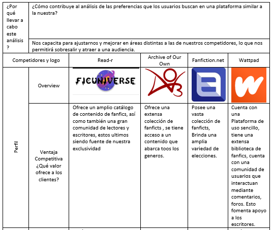
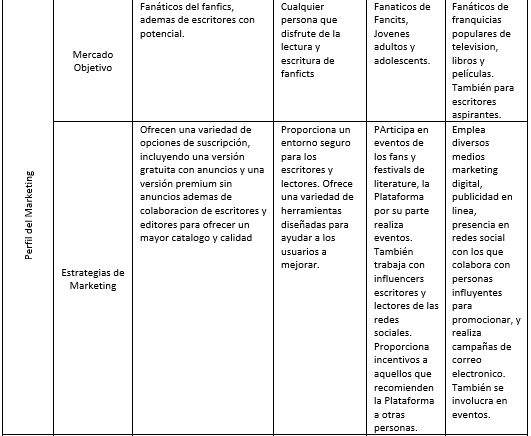
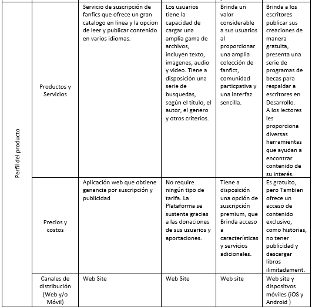
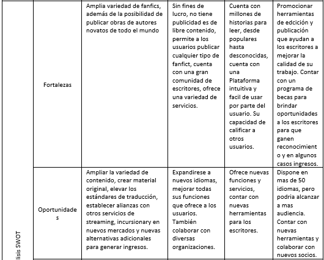
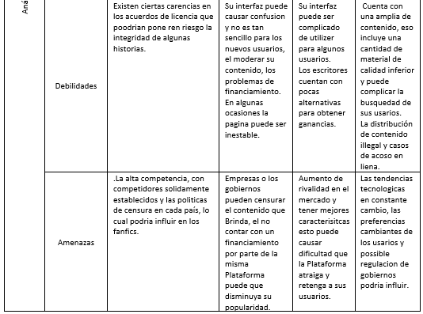

### 2.1.2. Estrategias y tácticas frente a competidores
- Asegurar la calidad del contenido: Los fanfics que pongamos a disposición contarán con traducciones y de alta calidad. Dado que la calidad del contenido es fundamental, nos esforzamos para evitar que los lectores se sientan decepcionados y así poder asegurar su fidelidad.
- Fomentar la creación de una comunidad: Facilitar un espacio de discusión, ya sea un foro o una sección de interacción, para que los lectores interactúen entre si y con los escritores representen una excelente forma de establecer una comunidad. Los lectores puedan debatir sus opiniones y compartir recomendaciones. 
- Estrategias de Marketing: Implementar una estrategia de promoción que incluirá publicidad en línea, campañas en redes sociales y realizar eventos para los usuarios, realizar colaboraciones con otros sitios web similares. 
- Ofrecer una experiencia de usuario atractivo: Diseñar una página web de fácil uso con una interfaz de usuario intuitiva para el usuario. Además, consideramos la implementación de funciones como búsquedas avanzadas y opciones de filtrado de títulos para facilitar al usuario. 
- Proporcionar contenido exclusivo: la oferta de contenido exclusivo, como ver los capítulos adelantados, con la finalidad de atraer a los lectores y mantenerlos comprometidos con la plataforma. 

## 2.2. Entrevistas

### 2.2.1. Diseño de entrevistas
**Para escritores:**

Preguntas introductorias:
- ¿Cuál es su nombre completo y cuántos años tiene? Además, ¿en qué distrito se encuentra actualmente?
- ¿A qué se dedica actualmente?
-	¿Cuáles son los dispositivos que utiliza principalmente?
-	¿Qué te motiva a escribir fanfics y compartirlos en línea?
-	¿Qué género de historias te gusta producir y cuál es la razón?

Preguntas principales:
-	¿Cómo evalúas la accesibilidad de publicar tus fanfics en formato digital para llegar a una audiencia considerable?
-	¿Has tenido la posibilidad de generar ingresos a través de tu labor?

De ser el caso:

-	¿Fue fácil lograr rentabilizar tu obra?

Caso contrario:
-	¿Has explorado oportunidades para obtener ingresos con tu contenido?
-	En caso de que hayas intentado monetizarlo, ¿qué obstáculos o dificultades encontraste que impidieron que lo lograras?
-	En caso de que no hayas buscado monetizarlo, ¿te interesaría recibir alguna forma de recompensa económica por tu trabajo?
-	¿Cómo te gustaría que una plataforma en línea te ayudara en tu proceso de creación de contenido?
-	¿Qué funcionalidades esperarías de una plataforma en línea para simplificar el proceso de creación y compartición de contenido?
-	Desde tu perspectiva como creador de contenido, ¿cuál crees que es el aspecto más crucial para que una plataforma en línea sea efectiva?
-	¿De qué manera te gustaría recibir incentivos o reconocimientos por tu labor en una plataforma en línea?
-	¿Qué tipo de feedback o interacción con los lectores valoras más como autor de fanfics?

**Para lectores de contenido:**

Preguntas introductorias:
-	¿Cuál es su nombre completo y cuántos años tiene? Además, ¿en qué distrito se encuentra actualmente?
-	¿Cuáles son los aspectos que disfrutas al leer fanfics?
-	¿Cuáles son los dispositivos que utiliza principalmente?
-	¿Cuáles son los géneros de fanfics que captan más tu interés y cuál es la razón detrás de esa preferencia?

Preguntas principales:
-	¿En qué lugares frecuentas para buscar y consumir contenido en línea?
-	¿Qué funciones esperarías de una plataforma en línea para hacer la experiencia de lectura más sencilla?
-	¿Cómo te gustaría que la plataforma te ayude a descubrir nuevos fanfics relacionados con tus intereses?
-	¿Cómo te gustaría que una plataforma web reconociera y premiara a los autores talentosos?
-	¿Qué tipos de recompensas o estímulos te gustaría recibir por participar en la lectura y compartición de contenido en una plataforma en línea?
-	Desde tu perspectiva como lector de contenido, ¿qué crees que es esencial para que una plataforma en línea te resulte beneficiosa?
-	¿Qué expectativas tienes acerca de cómo una plataforma en línea podría asistirte en el seguimiento y la gestión de los contenidos que te atraen?
-	¿Valorarías la opción de poder seguir a autores o historias específicas en la plataforma?

### 2.2.2. Registro de entrevistas

*Escritor*

Nombre: Nelson Maicol Guevara Oré 

Edad: 23 años

Distrito: San Miguel, Lima

Nelson es un universitario que en sus pasatiempos se dedica a escribir fanfics. El comenta que ha realizado algunas publicaciones de sus fanfics y ha logrado obtener algunos ingresos, pero se debe a que sus seguidores le dieron de forma voluntaria y tampoco ha llegado a expandir con sus historias. 
A el le gustaría confiar en una plataforma que le brinde herramientas necesarias para poder seguir creciendo como escritor y le den visibilidad para poder ser conocido y tener ingresos mas solventes y fijos ya que eso le daría más confianza en seguir creciendo.

Nombre completo: Bhelén Orellana Patazca

Edad: 20 años

Distrito: Monsefú, Chiclayo

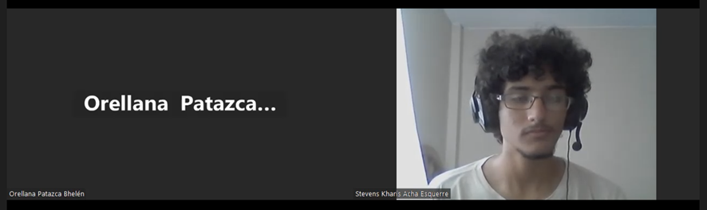

Bhelén es una universitaria que escribe historias en sus tiempos libres. A ella le gustaría empezar a publicar sus historias, pero teme que estas no lleguen al público objetivo, y que no pueda surgir como escritora amateur.
A Bhelén le gustaría que en la aplicación web se pudiese escribir los escritos de una manera familiar, semejante a la interfaz de Word. Asimismo, desea que sea sencilla de entender y que exista una herramienta que le ayude a conocer la tecnología en su totalidad. Por otro lado, desea recibir feedback de los usuarios a través de la aplicación, pero desea poder controlar los comentarios negativos mediante filtros. 
Finalmente, piensa que la startup es una gran apuesta para ella, ya que le permitiría centrar la publicación de sus historias con seguridad de que llegará a sus usuarios objetivos, además de significar un ingreso económico a largo plazo.

*Lector*

Nombre completo: Ana Valentina Jimenes Cruz

Edad: 21 años

Distrito: Pachacamac

Ana es una universitaria que lee fanfics en sus tiempos libres. Ella disfruta de leer las interacciones entre los lectores con el autor y entre ellos. Emplea principalmente su celular para leer y los géneros que más lee son el romance y el mismo género “fanfic” (relaciones entre personajes creadas por los fans)
Ana visita principalmente Wattpad y AO3 (Archive of Our Own), ya que son los dos sitios más grandes para leer contenido fanfiction. Ella considera que es difícil encontrar fanfics específicos en los sitios que visita, y le gustaría que la plataforma cuente con una funcionalidad que facilite la búsqueda.
Ana quisiera que la página le mostrase datos como las vistas, likes y comentarios del fanfic, de forma que tiene una idea si el fanfic que leerá será interesante.
Ella conoce que Wattpad da premios y ayuda a los escritores a publicar sus fanfics de manera oficial en formato físico. Considera que es una buena forma de incentivar a los escritores a seguir con su buen trabajo.
Sobre recompensas, considera que sería bueno que la aplicación diera a los lectores la posibilidad de leer capítulos de pago de manera gratuita por compartir o leer muchos capítulos gratuitos.
La idea de aplicación le pareció interesante, y le gustaría que nos enfoquemos en puntos clave: Que sea visualmente agradable y moderna, que contenga un sistema de bibliotecas y favoritos, así como seguimientos, y que su sistema de búsqueda cuente con filtros con el fin que sea más sencillo encontrar los fanfics de su preferencia.

Nombre completo: Maren Luna

Edad: 19 años

Distrito: San Juan de Lurigancho 

La entevistada disfruta leer los fanfics porque visualiza las imagenes que para ella es muy importante, comenta que suele descargaar los fanfics de cualquier página que encuentre. No le agrada que ciertas páginas no se puedan leer correctamente los fanfics, le gustaría que una plataforma permita agregar comentarios. No le gustaria un algoritmo que le muestre fanfics de autores que ya ha leido.

Nombre completo: Pablo Espejo

Edad: 20 años

Distrito: Surco

Pablo nos comenta que disfruta leer, y para leerlo utiliza su laptiop y celular. El no es seguidor de una sola página, inclusive lee en redes sociales, como por ejemplo Twitter y Facebook, le agradaría que una página pueda tener opción de poder ajustar el tamño de letra y color para poder leer agusto el fanfic, lo mismo para el fondo. Le parece interesante que una plataforma cuente con un apartado para las recomendaciones de acuerdo a sus gustos. Considera que se le debe pagar al creador de fanfics 

### 2.2.3. Análisis de entrevistas
- Lectores:

Se valora la comunidad la accesibilidad a las métricas. Además, se considera que se debe brindar recompensas y apoyo a los escritores.
Los entrevistados consideran que una plataforma con características claves como bibliotecas, favoritos y búsqueda avanzada, esto seria ideal para mejorar la experiencia de la lectura de fanfics. También le gustaría obtener recompensas cada vez que lee un fanfic. Considera importante que la plataforma siempre se actualice constantemente.

- Escritores:

Buscas una plataforma que ayuden a crecer como escritor, que aumente su visibilidad y obtener ingresos estables.
Una plataforma que les brinde herramientas necesarias para poder crear sus fanfics y no tener inconvenientes al subir a la plataforma.

## 2.3. Needfinding
### 2.3.1. User Personas

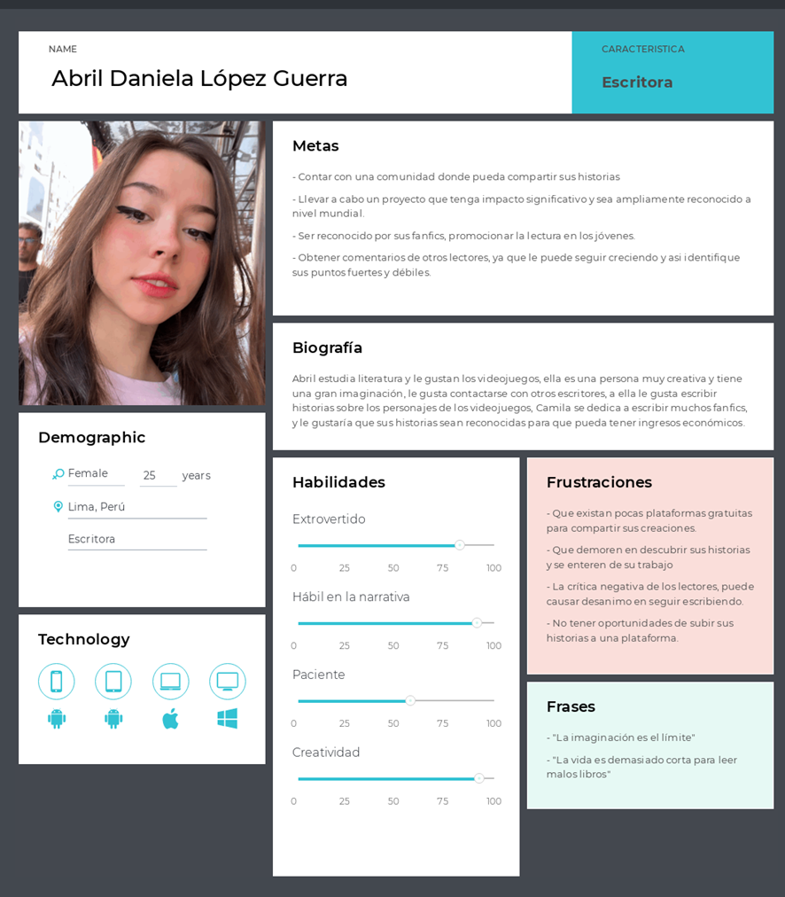

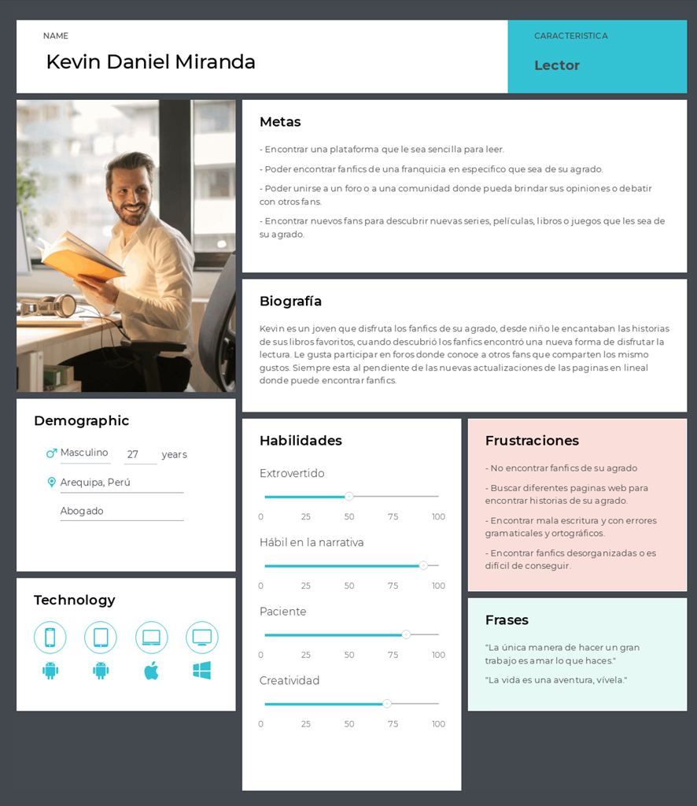

### 2.3.2. User Task Matrix

*Escritores*

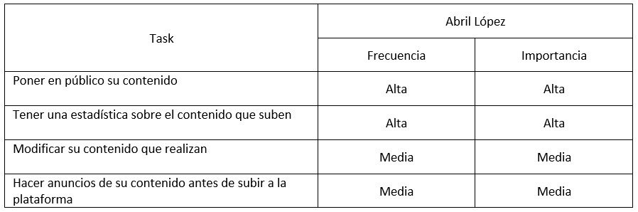

*Lectores*

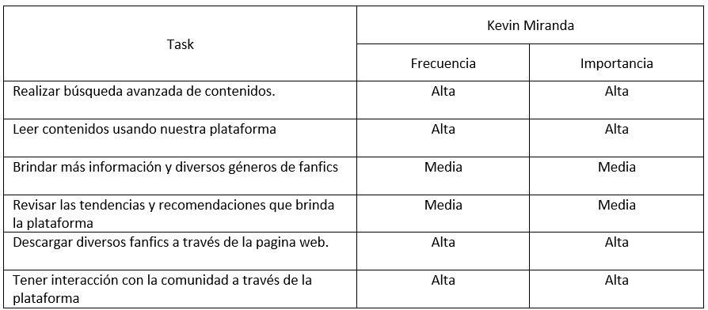

### 2.3.3 User Journey Mapping

*Escritores*

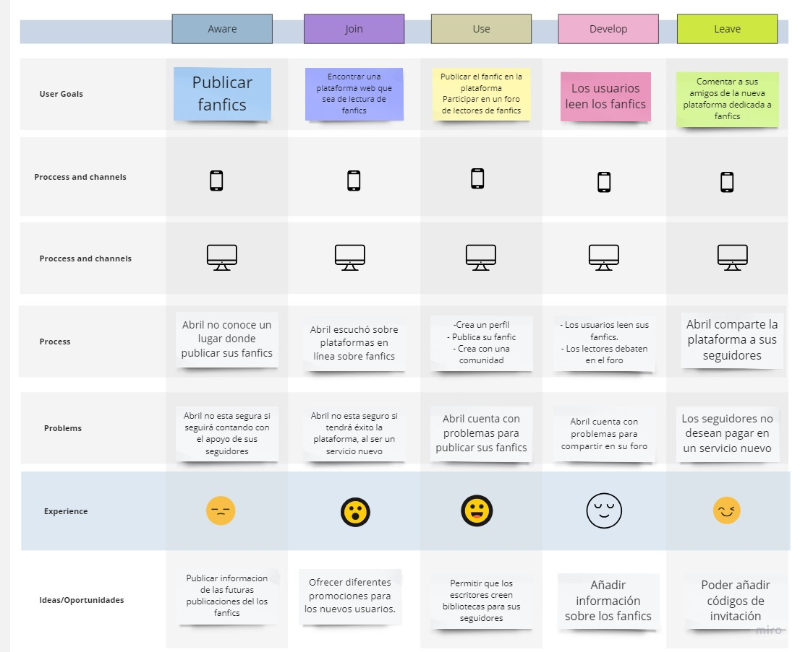

*Lectores*

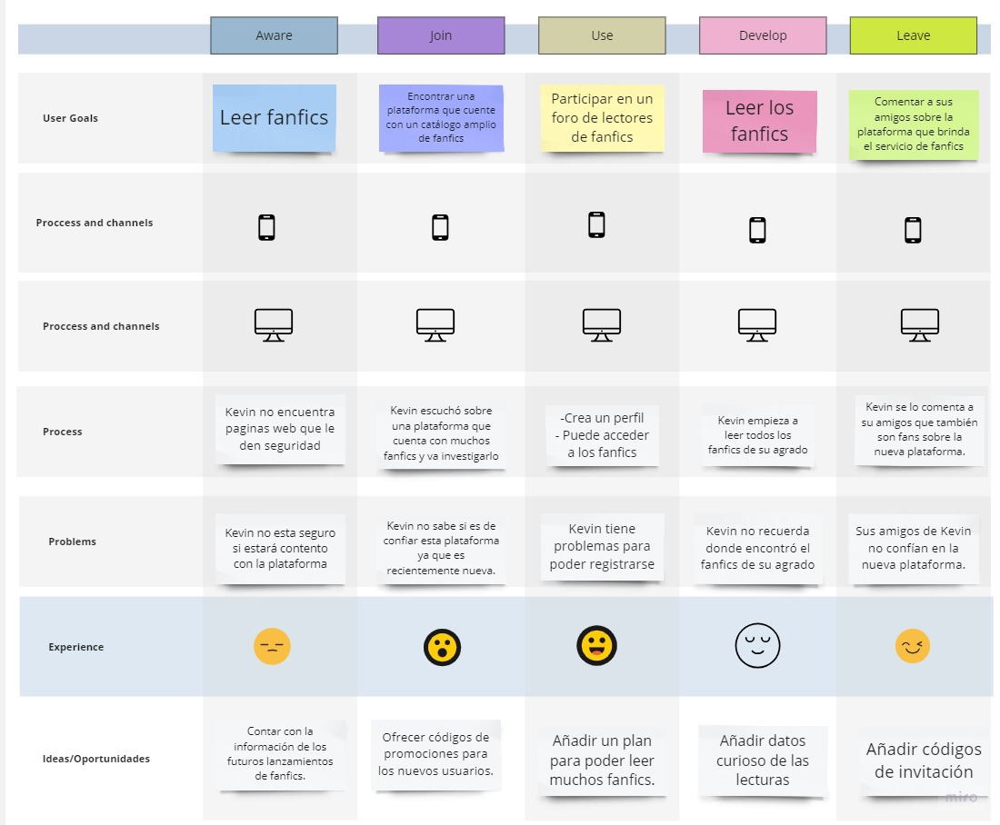

### 2.3.4. Empathy Mapping

*Escritores*

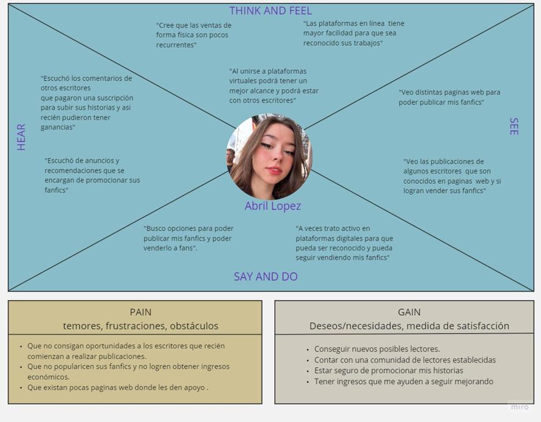

*Lectores*

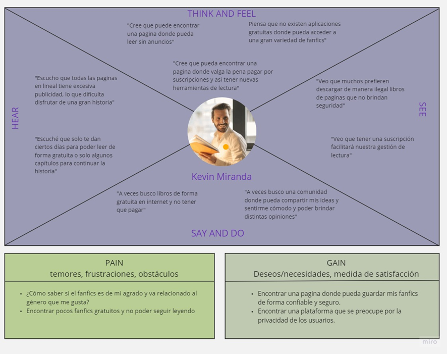

### 2.3.5 As-Is Scenario Mapping

*Escritores*

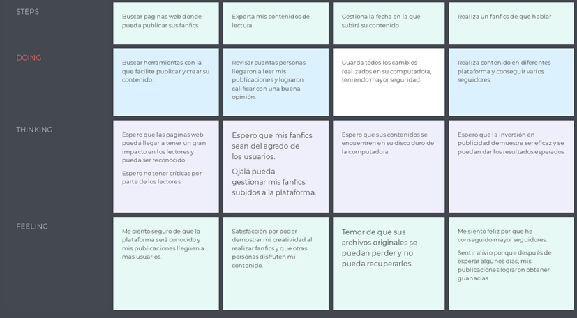

*Lectores*

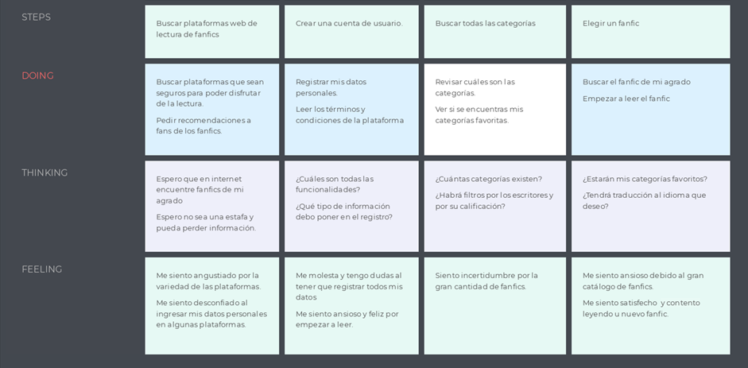

# Capítulo III: Requirements Specification

## 3.1. To-Be Scenario Mapping

Creador de contenido

Lector de contenido

## 3.2. User Stories

Creador de contenido

Lector de contenido

.jpeg)

## 3.3. Impact Mapping

## 3.4. Product Backlog

# Capítulo IV: Product Design
## 4.1. Style Guidelines
### 4.1.1. General Style Guidelines
Para el branding de la startup se tendrá a disposición las siguientes imágenes:

Por otro lado, el branding que utilizaremos para nuestro servicio (FicUniverse), serán los siguientes modelos:

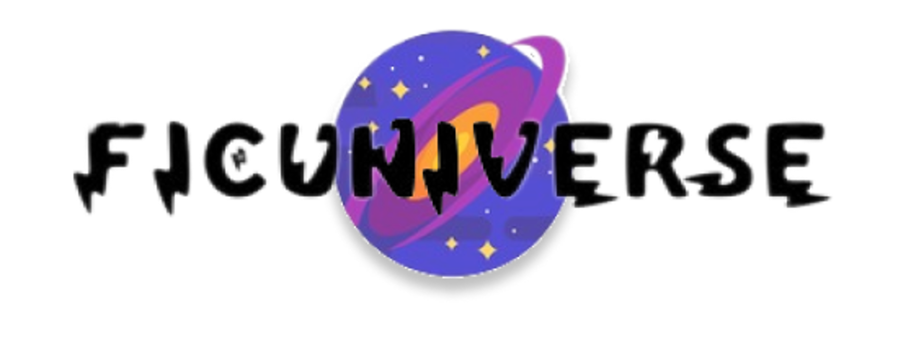

#### **Typography**
Se optó por utilizar la tipografía "Inter", debido a que es simple, fácil de leer y está diseñada para ayudar con la legibilidad de letras minúsculas y mayúsculas para el lector. (Google fonts, s.f.).

#### **Colors**
Brand colors:

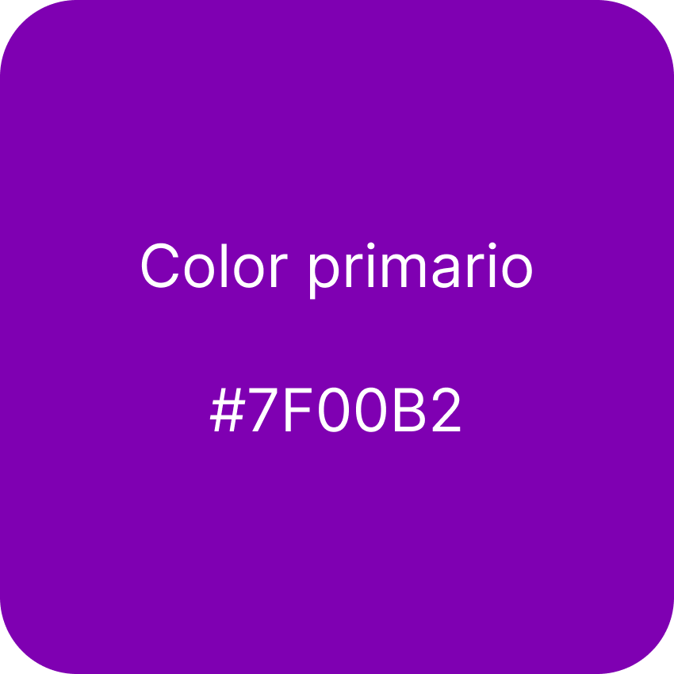
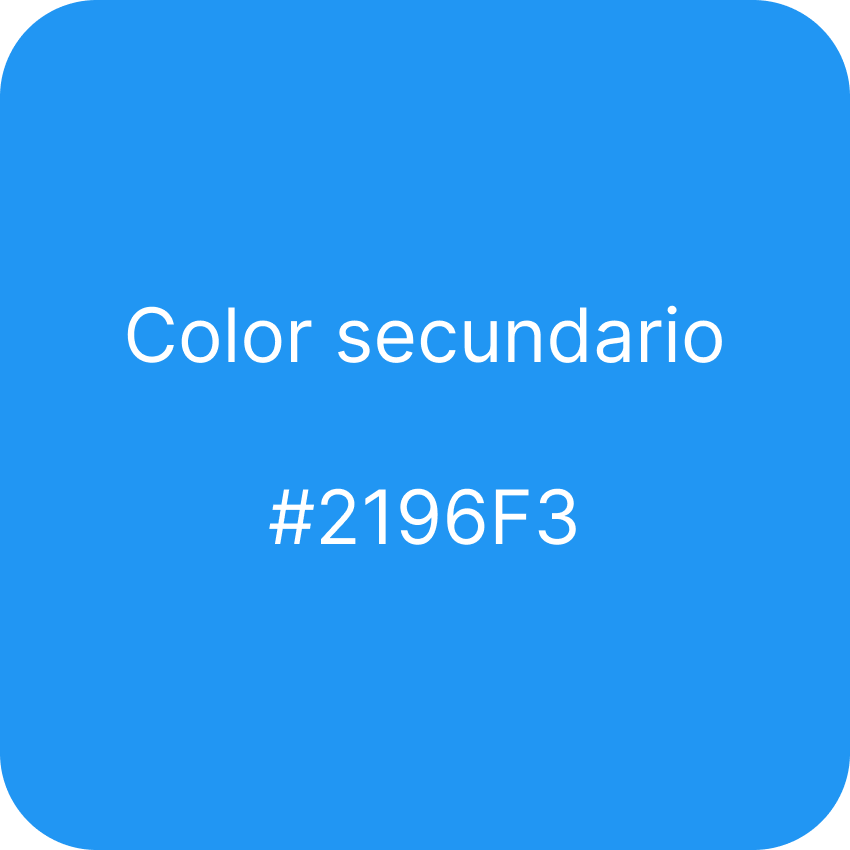

Para el resto de colores de los aspectos básicos de la aplicación, se utilizará la siguiente paleta de colores:

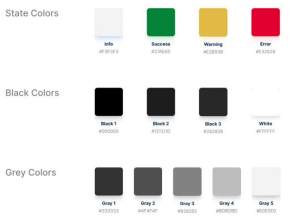

#### **Spacing**

Para el uso de espaciado en nuestra aplicación, usaremos multiplos de 8 en un rango amplio para poder tener a nuestra disposición distintos tamaños para los elementos según sea requerido.

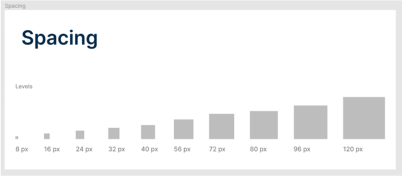

#### **Tono de comunicación y lenguaje aplicado**

Al tener como segmento objetivo a jóvenes (en su mayoría) y adultos lectores y/o escritores de fanfics, en un rango de entre 18 y 40 años, hemos optado por utilizar un tono divertido, casual, respetuoso y sereno para que estos puedan sentir que están en una aplicación juvenil, remarcando la energía y emoción al momento de leer sus historias favoritas.

### 4.1.2. Web Style Guidelines

Uno de los aspectos más importantes en el desarrollo web es el uso correcto del responsive design para que la aplicación se visualice perfectamente sin importar el tamaño de la pantalla o dispositivo.

Por esta razón, se decidió realizar el desarrollo de nuestra solución tomando en cuenta los siguientes breakpoints para que el responsive design se muestre correctamente:

| Breakpoint prefix | Minimum width |
|-----------|----------|
| sm | 640px |
| Md | 768px |
| L | 1024px |
| xl | 1280px |
| 2xl | 1536px |

Con respecto a los estándares visuales, se utilizarán los mismos elementos presentados en la sección anterior para lograr uniformidad en todo el uso de nuestra aplicación. Igualmente, las medidas y propiedades presentadas son escalables, manejables y compatibles con el desarrollo de responsive design.

## 4.2. Information Architecture
### 4.2.1. Organization Systems

El área de diseño de nuestra startup decidió enfocarse principalmente en la facilidad o satisfacción que el usuario tendrá al usar nuestra aplicación. Todos los elementos de diseño que hemos utilizado como las paletas de colores, imágenes e íconos, han seguido una tendencia minimalista con el fin de no exponer a los usuarios con tanta información.

### 4.2.1. Organization Systems

En el caso del landing page de nuestra aplicación nos hemos basado en el sistema de organización jerárquica (o “Visual hierarchy”, en inglés). La razón de esta elección es debido al impacto positivo que una página bien distribuida según tamaños, espacios y colores brinda al usuario. Por ejemplo, en la primera vista del landing page se añadirán elementos de tamaños grandes y con colores únicos (como el botón call to action), para captar la atención del visitante. Asimismo, mientras se hace scroll down por la página los tamaños se verán reducidos.

Por otro lado, cuando el usuario entre a la aplicación web en sí, utilizaremos un sistema de organización matricial (en inglés, “Matrix”). Este sistema, a diferencia del jerárquico, es un poco más complejo para el usuario porque está diseñado para que el usuario tome el control de su navegación (tubik, 2017). Sin embargo, al ser una aplicación basada en la lectura y/o escritura fanfics, es necesario dividir las secciones de esta manera para que se pueda tener mejor organizado lo que ofrecemos.

En nuestra aplicación se aplican los cuatro esquemas de categorización de contenido, mediante un sistema de filtros para buscar contenido. Se podrá rotar entre el Alphabetical, Chronological, Topic y Audience schemes.

### 4.2.2. Labeling Systems

Sera realizado de tal forma que las palabras utilizadas sean simples y fáciles de entender. Las etiquetas en la aplicación tendrán un máximo de cuatro palabras.

Esto se verá reflejado cuando hagamos la presentación del landing page y web application, de manera que sea más sencillo entender este concepto y cómo buscamos realizarlo.

### 4.2.3. SEO Tags and Meta Tags

Title: Readr

Description: Registrate y descrubre las mejores historias de tus personajes favoritos, o escribe tus propias historias. Adentrate en Readr!

Keywords: Fanfic, Fanfiction, Lectura, Novelas, Escritura.

Author: Programadores de Lavadoras.
### 4.2.4. Searching Systems

Se optó por implementar una interfaz que resalte los botones  e información principal para llamar la atención de los usuarios más emocionales e invitarlos a entrar en nuestra aplicación. Sin embargo, para los usuarios racionales, se ha brindado información más detallada para que puedan tomar la decisión de utilizar nuestro producto.

Es por estas razones que disponemos de los botones “call to action” que permiten llevar al usuario al registro para empezar a hacer uso de la aplicación. Se han posicionado al inicio y al final del landing page.

Con respecto a la aplicación, vamos a resaltar los subtítulos más importantes que dividen las funcionalidades de esta, para que a los usuarios se les facilite encontrar lo que buscan.

### 4.2.5. Navigation Systems

Se buscará priorizar fluidez a través de todo el contenido de nuestra landing page y aplicación web, con la capacidad de encontrar toda la información necesaria.

De esta manera, el usuario no se sentirá frustrado o confundido por una mala organización de la información.

En consecuencia, todo el diseño trabajado para nuestro proyecto, será enfocado en cumplir estas reglas establecidas.

## 4.3. Landing Page UI Design
### 4.3.1. Landing Page UI Design
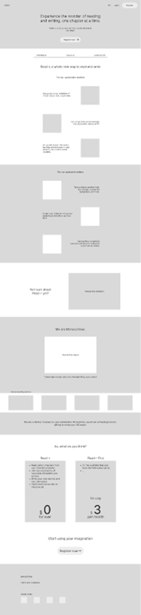

### 4.3.2. Landing Page Mock-up
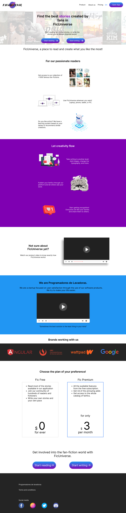

## 4.4. Web Applications UX/UI Design
### 4.4.1. Web Application Wireframes
Register

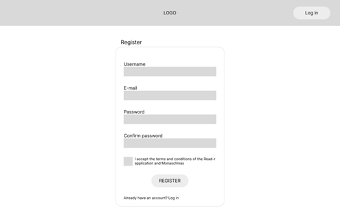

Log in

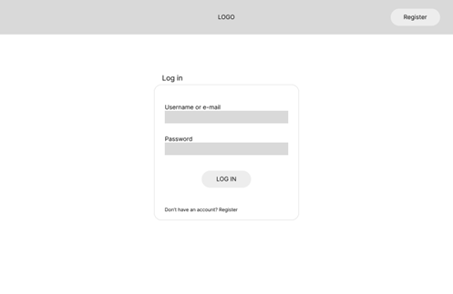

Home 1

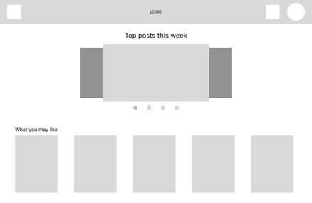

Home 2

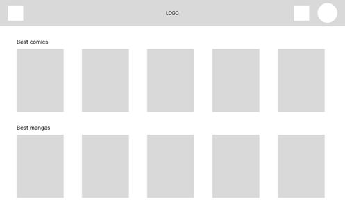

Home 3

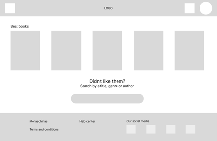

My profile

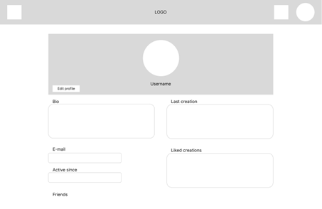

Another person profile

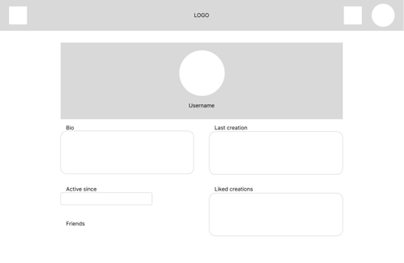

Creations 1

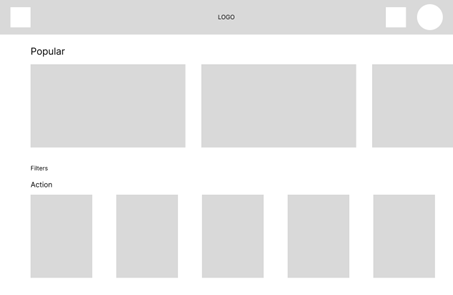

Creation 2

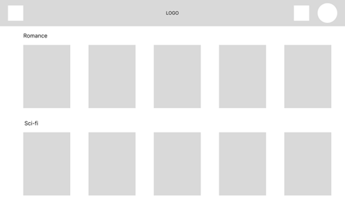

Reading

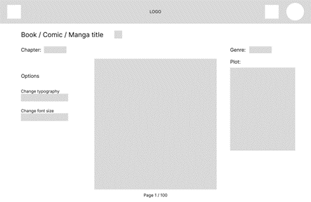

Writing

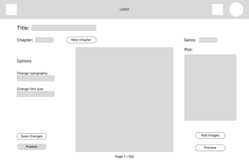

Authors

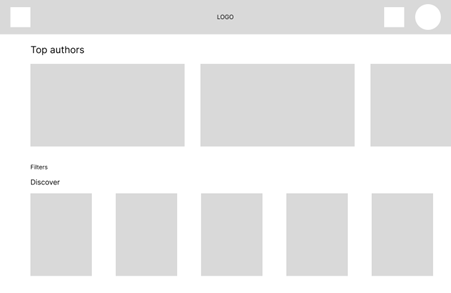

### 4.4.2. Web Application Wireflow Diagrams

User goal 01: Entrar a la aplicación mediante una cuenta
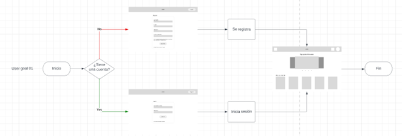

1.	Ingresa a la aplicación web "FicUniverse".
2.	Si tiene una cuenta inicia sesión. Si no, se registra.
3.	Entra a la cuenta.

User goal 02: Ingresar al perfil de usuario
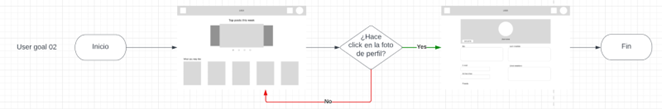

1.	Ingresa a la aplicación web “FicUniverse”.
2.	Hace click en la foto de perfil de usuario.
3.	Visualiza sus datos.

User goal 03: Leer un Fanfic
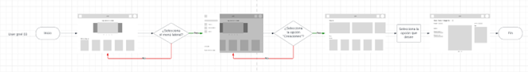

1.	Ingresa a la aplicación web "FicUniverse".
2.	Abre el menú lateral.
3.	Selecciona la opción “Creaciones”.
4.	Selecciona el fanfic que desee.
5.	Se abre la vista de lectura.

User goal 04: Escribir cualquier Fanfic
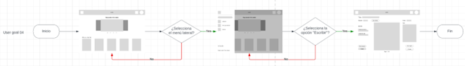

1.	Ingresa a la aplicación "FicUniverse".
2.	Abre el menú lateral.
3.	Selecciona la opción “Escribir”.
4.	Edita su obra.

User goal 05: Buscar y seleccionar un autor
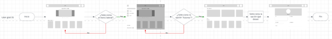

1.	Ingresa a la aplicación "FicUniverse".
2.	Abre el menú lateral.
3.	Selecciona la opción “Autores”.
4.	Escoge el autor que desee.
5.	Visualiza su perfil

### 4.4.3. Web Applicationns Mock-up

 Register

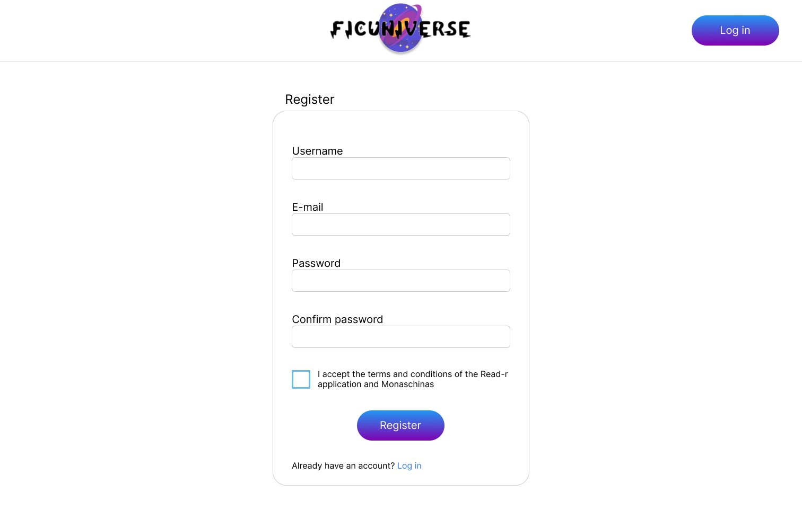

Log in

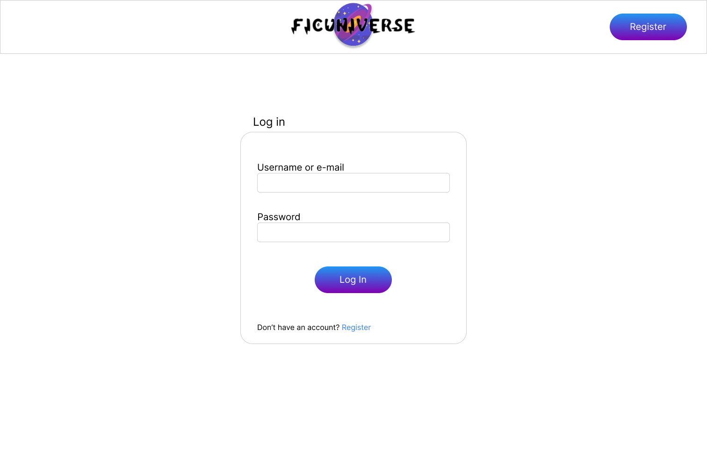

Home 1

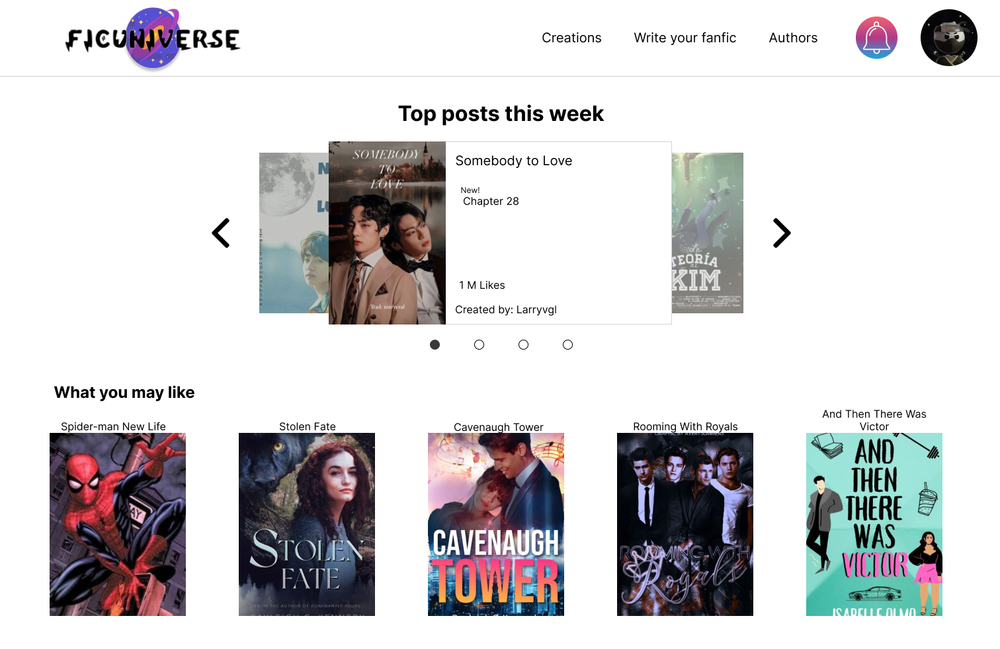

Home 2

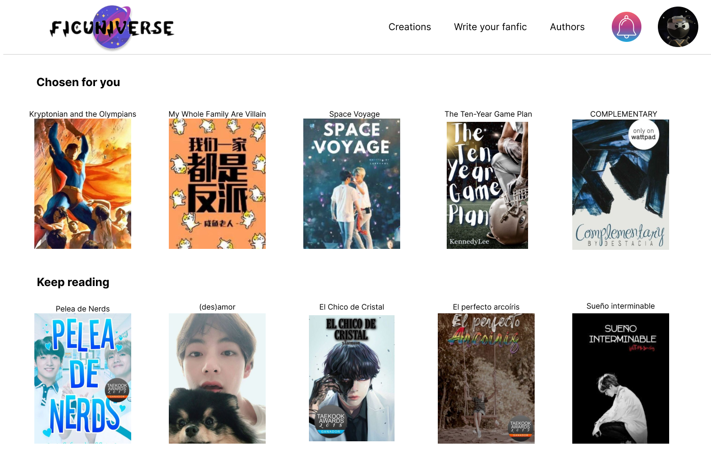

Home 3

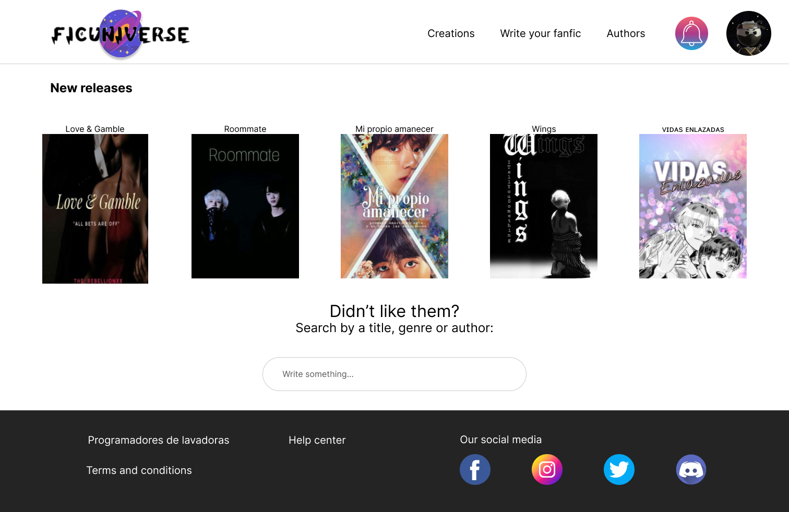

My profile

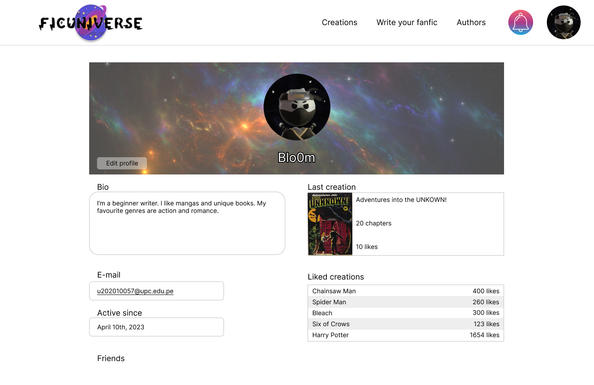

Another person profile

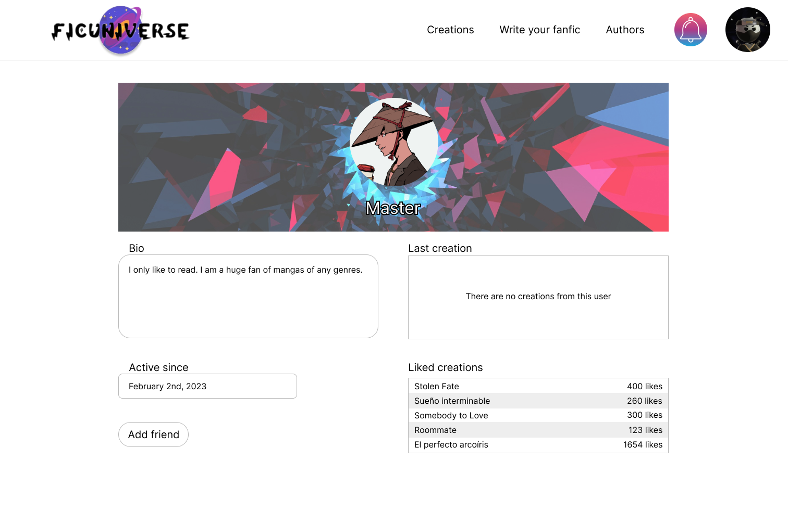

Creation 1

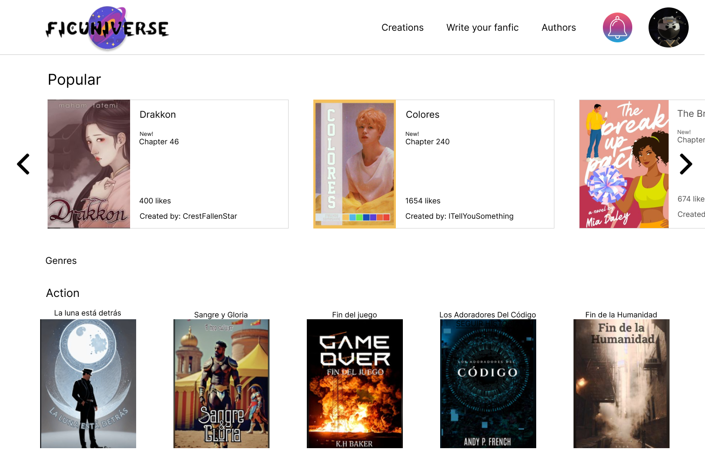

Creation 2

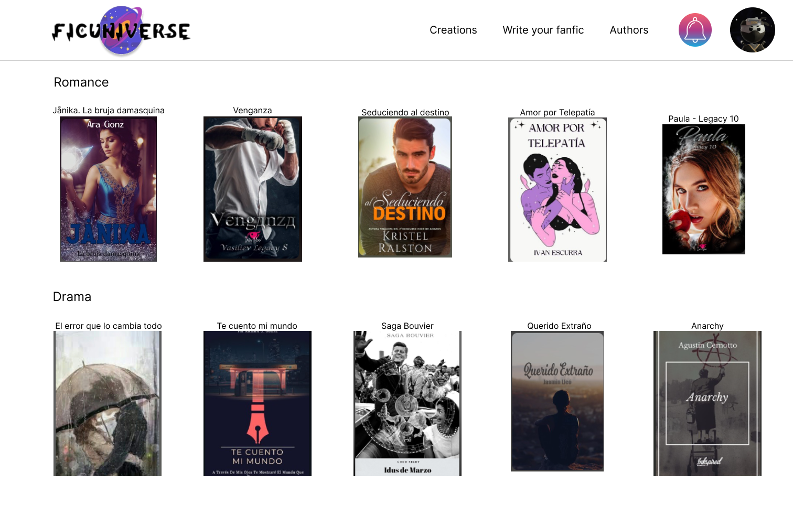

Reading 

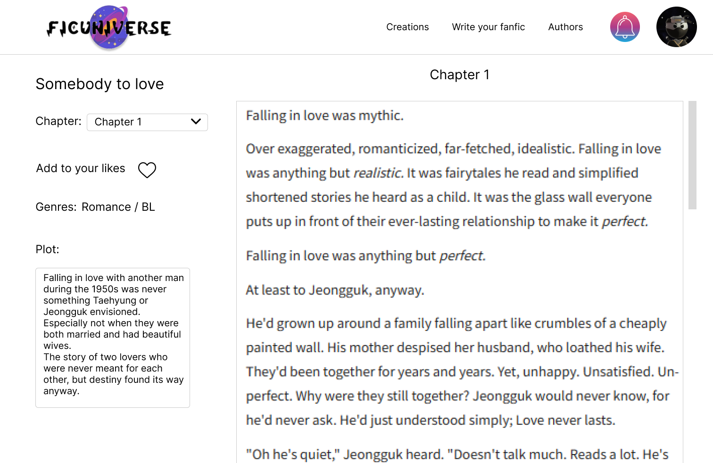

Writing


Authors


### 4.4.4. Web Application User Flow Diagrams

User Flow 01: Entrar a la aplicación mediante una cuenta

- Happy path: Puede crear una cuenta o iniciar sesión satisfactoriamente
- Unhappy path: No ingresa los datos correctamentes

User Flow 02: Ingresar al perfil de usuario


- Happy path: Puede visualizar sus datos del perfil
- Unhappy path: No ingresa a su perfil o no se visualizan los datos

User Flow 03: Leer un fanfic
- Happy path: Puede leer la creación seleccionada
- Unhappy path: No carga la selección o no se muestra la información

User Flow 04: Escribir cualquier obra

- Ingresa a la aplicación “FicUniverse”.
- Selecciona la opción “Escribir”.
- Edita su obra.

User goal 05: Buscar y seleccionar un autor

- Ingresa a la aplicación “FicUniverse”.
- Selecciona la opción “Autores”.
- Escoge el autor que desee.
- Visualiza su perfil

## 4.5. Web Application Prototyping

Para la creación del prototipo de la Web Application nos hemos enfocado en las funcionalidades más importantes de nuestra aplicación. Es decir, poder leer o escribir libros, cómics o mangas. De igual manera, hemos agregado otras funcionalidades como vista de perfiles o autores para que se entienda mejor cómo funciona el apartado social de la aplicación.


## 4.6. Domain-Driven Software Architecture

Para esta sección hemos empleado los principios de Domain-Driven Design (DDD) en conjunto con el modelo de visualización de la arquitectura de software C4 (Context, container, components and code).

**Herramientas del domain-driven design:**

A continuación, se muestran los principales ejemplos del uso de las herramientas de DDD aplicados a nuestro dominio, tales como el Storytelling, Event Storming, Domain message flow modeling y Bounded context canvas.

**Storytelling:**

Publishing a literary product:


Looking for a literary product:


Reading a literary producto
 


**Event storming:**

Leyenda

Publicación de productos literarios


Visualizacion de productos literarios


Lectura de productos literarios


**Domain Message Flow Modeling:**

Elementos


Escenario: Publicación de un producto literario nuevo


**Bounded context canvas:**

Leyenda de colaboradores


Publicación de un producto literario


En esta sección se especifican los Ubiquitous Language para cada subdominio del negocio. Sin embargo, no es necesario especificarlo para todos ya que el negocio no presenta términos complejos, sino palabras claves conocidas por todos los involucrados.

### 4.6.1. Software Architecture Context Diagram

Este diagrama corresponde al diagrama de contextos del modelo C4. En él se detalla los principales usuarios, nuestro sistema y los sistemas externos que emplearemos. Asimismo, se muestra la relación entre cada elemento.


Landscape diagram:

### 4.6.2. Software Architecture Container Diagrams

Este diagrama corresponde al diagrama de contenedores del modelo C4. Aquí se especifican los contenedores y bounded context que conforman nuestro sistema Read-R, tomando elementos como el Landing, el Api Rest, la base de datos, etc. Y detalla en qué contexto están relacionados los sistemas externos con nuestro sistema de software.


### 4.6.3. Software Architecture Components Diagram

Estos diagramas corresponden a los diagramas de componentes del modelo C4. Aquí se detalla mucho más cada bounded context que conforma nuestro software Read-R, mostrando sus componentes y la relación entre ellos.

Account Context:


Visualization Context:

Publishing context:


Reading context:


Payment context:


## 4.7. Software Object-Oriented Design
### 4.7.1. Class Diagrams


### 4.7.2. Class Dictionary

| **Plan** | |
| --- | --- |
| **Atributo** | **Descripción** |
| - name: String | El nombre que recibe el plan (ej. Entry Readr o Expert Readr). |
| - description: String | La descripción sobre el plan elaborado |

| **PlanPrice** | |
| --- | --- |
| **Atributo** | **Descripción** |
| - frequency: Frequency | Un objeto de la clase Frequency que encapsula la lógica que abarca la frecuencia en la que es vigente el Plan. |
| - price: Money | Un objeto de la clase Price que encapsula la lógica que abarca un valor monetario. Incluye la referencia al currency y valor correspondiente. |

| **PlanDiscount** | |
| --- | --- |
| **Atributo** | **Descripción** |
| - percentApplied: float | El valor del porcentaje de descuento que se aplica al precio del plan. |
| - maxAmountOfUsages: int | Un entero que permite conocer cuántos usos como máximo tiene el descuento |
| - amountOfUsages: int | Un entero que indica cuántas veces ha sido utilizado el descuento. |
| **Método** | **Descripción** |
| + isAvailable(): boolean | Un método que permite determinar si el descuento está disponible. |
| + decreaseUsages(quantity: int): void | Un método que permite decrementar la cantidad de usos del descuento. |
| + increaseUsages(quantity: int): void | Un método que permite incrementar la cantidad de usos del descuento. |

| **FeatureActivatable** | |
| --- | --- |
| **Atributo** | **Descripción** |
| - value: boolean | Un boolean que permite conocer si la feature está activa o no. |
| **Método** | **Descripción** |
| + getDescription(): String | Retorna la descripción del feature. En este caso, se planteó como FeatureActivatable el disponer de acceso ilimitado al contenido. |

| **FeatureSingleAccountableValue** | |
| --- | --- |
| **Atributo** | **Descripción** |
| - value: number | Un valor que permite conocer un límite que se puede establecer sobre una característica. |
| **Método** | **Descripción** |
| + getDescription(): String | Retorna la descripción del feature. En este caso, se planteó como FeatureSingleAccountableValue el disponer de un límite de capítulos que se pueden leer al ser usuario free. |

| **Subscription** | |
| --- | --- |
| **Atributo** | **Descripción** |
| - startedAt: Date | La fecha en la que inició la suscripción. |
| - finishedAt: Date | La fecha en la que terminó la suscripción. |
| **Método** | **Descripción** |
| + isActive(): boolean | Un boolean que permite conocer si la suscripción está activa |

| **User** | | 
| --- | --- |
| **Atributo** | **Descripción** |
| - username: String | El nombre de usuario que será su identificador dentro de la aplicación entre los demás usuarios. |
| - email: String | El correo del usuario. |
| - password: String | La contraseña hasheada. |
| - account: Account | Una referencia a la cuenta a la cuál se está asociado el usuario. |
| **Método** | **Descripción** |
| + closeAccount(): void | Un método para cerrar la cuenta a la que se está asociado. |
| + isAccountOwner(): boolean | Un método que permitirá conocer si el usuario fue el mismo que creó la cuenta (ej. no proviene de una organización). |

| **Account** | | 
| --- | --- |
| **Atributo** | **Descripción** |
| - firstName: String | El nombre de la persona que utiliza la cuenta. |
| - lastName: String | El apellido de la persona que utiliza la cuenta. |
| - createdBy: User | Una referencia al usuario que creó su cuenta. |
| **Método** | **Descripción** |
| + changeSubscription(newPlan: Plan): void | Un método que le permitirá cambiar de la suscripción a la que está sujeta la cuenta. |
| + getCurrentSubscription(): Subscription | Un método que permitirá acceder a la suscripción actual de la cuenta. |
| + changeOwner(newOwner: User): void | Un método para cambiar el propietario de la cuenta (quién la creó). |

| **Book** | |
| --- | --- |
| **Atributo** | **Descripción** |
| - title: String | El título del libro. |
| - publishedDate: Date | La fecha en la que se publicó el libro. |
| - author: Author | Una referencia al autor del libro. |
| - synopsis: String | La sinopsis del libro. |
| - language: String | El lenguaje en el que se escribió el libro. |
| - status: BookStatusType | Indica en qué estado se encuentra el libro (publicándose, en pausa, terminado, cancelado). |
| - genres: List\<Genre\> | Una lista de los géneros en los que se clasifica el libro. (ej. Ficción, Aventura, Sci-Fi, etc.). |
| - chapters: List\<Chapter\> | La lista de capítulos que conforman al libro en su totalidad. |
| **Método** | **Descripción** |
| + getNumberOfChapters(): int | Un método que permitirá conocer cuántos capítulos en total contiene el libro. |
| + getNumberOfPages(): int | Un método que permitirá conocer la cantidad total de páginas que contiene el libro. |

| **Saga** | |
| --- | --- |
| **Atributo** | **Descripción** |
| - title: String | El título que recibe la saga. |
| - books: List\<Book\> | Los libros que componen la saga. |
| - synopsis: String | La sinopsis de la saga. |
| - language: String | El lenguaje en el que se encuentra la saga. |
| - status: SagaStatusType | Indica el estado en el que se encuentra la saga (publicándose, en pausa, terminado o cancelado). |

| **BookRepository** | |
| --- | --- |
| **Atributo** | **Descripción** |
| - repository: DatabaseManager | El repositorio que proviene de la base de datos. |
| **Método** | **Descripción** |
| + addBook(newBook: Book): void | El método que nos permitirá agregar un nuevo libro al repositorio. |
| + removeBook(bookToErase: Book) | El método nos permitirá eliminar un libro del repositorio |
| + getBooks(): List\<Book\> | El método que nos permitirá obtener la lista completa de los libros. |

| **BlogPost** | |
| --- | --- |
| **Atributo** | **Descripción** |
| - title: Author | Guarda una referencia al autor del blog post. |
| - tags: List\<Tags\> | La lista de tags a la que pertenece el blogspot (ej. educación, dibujo, técnicas, tips, consulta, etc.). |
| - documentContentUrl: String | Guarda el URL que hace referencia al documento en markdown que se renderiza para mostrar el blog post. |
| - comments: List\<Comment\> | La lista de comentarios que hay en el blog post. |

## 4.8. Database Design

### 4.8.1. Database Diagram


# Capítulo V: Product Implementation, Validation, & Deployment
## 5.1. Software Configuration Managment
### 5.1.1. Software Development Enviroment Configuration

A continuación, se procederá a describir cada una de las herramientas de software que han sido empleadas en el proyecto. Este apartado resultará de utilidad para facilitar que los actuales y futuros desarrolladores puedan colaborar en el ciclo de vida del proyecto gracias a tener una documentación sobre cómo se está llevando a cabo el desarrollo.

Project Management

Trello: https://trello.com/ 

Se empleó Trello para organizar y tener un registro de las tareas que están por hacer, se están realizando y ya están realizadas. De este modo, podemos tener una noción de cómo se está llevando a cabo el desarrollo de las diferentes actividades que quedan pendientes en el equipo. Esta es una aplicación web que es compatible con la gran mayoría de navegadores existentes y solamente requiere registrarse para tener una cuenta activa.

Discord: https://discord.com/ 

La plataforma de Discord se empleó para realizar las reuniones virtuales con los integrantes del equipo y tener un mejor medio para compartir contenido de diversas formas (compartir pantalla, imágenes, texto, video, etc.). Esta es una aplicación web, móvil y de escritorio que tiene amplia compatibilidad en cada una de sus versiones. Independientemente de la forma que se emplee para acceder a la aplicación, se requerirá tener una cuenta activa.

Requirements Management

Trello: https://trello.com/ 

En el manejo de los requirements se empleó Trello, ya que nos permite colaborar el backlog en equipo, nos proporciona una vista cómoda. Adicionalmente, deja clara nuestras prioridades y el enfoque como grupo. Es gratuita y necesitaremos registrarnos para utilizarla.
Product UX/UI Design:

UXPressia: https://uxpressia.com/ 

Se empleó esta herramienta para la creación de los User Personas, el Customer Journey Map, Empathy Map e Impact Map. Ya que cuenta con plantillas que facilitan el desarrollo de estos artefactos. Además, es colaborativo y gratuito con limitaciones. Para usar este software hace falta registrarnos y se puede acceder a él desde la gran mayoría de navegadores.

Miro: https://miro.com/es/ 

Miro ha sido empleado en el desarrollo de los escenarios mapping y escenario mapping para ambos segmentos objetivos.

Figma: https://www.figma.com/ 

Esta herramienta fue de vital importancia para la creación de los wireframes, mockups y mobile applications prototyping de manera colaborativa. Asimismo, su acceso es gratuito al contar con una cuenta registrada.

Software Development:

Landing Page:

El desarrollo del landing page se llevó a cabo con las tecnologías básicas para esta misma: HTML5, CSS3 y JavaScript. Además, para agilizar el desarrollo responsivo del landing page, se procedió a utilizar Tailwind CSS como framework de CSS. 
Frontend Web Application:

La aplicación web implica tener claro los conceptos básicos de HTML5, CSS3 y JavaScript, ya que se utilizó Angular como framework de JavaScript que emplea TypeScript. Asimismo, para la implementación más sencilla de componentes reutilizables y accesibles se empleó Angular Material como biblioteca de componentes UI.
Para emplear estas herramientas hace falta tener instalado node e instalar cada una de las herramientas con su respectivo comando según el manejador de paquetes que utilicemos (en nuestro caso, npm). 

Web Services:

Para los servicios web se empleó el estilo de arquitectura RESTful API. Además, se empleó Java como lenguaje de programación, ya que se estará empleando Spring Boot Framework para agilizar el desarrollo. 

Para utilizar estas herramientas se estará utilizando OpenJDK en su versión 20 (https://jdk.java.net/20/).

IDE’s de desarrollo:

WebStorm: https://www.jetbrains.com/webstorm/ 

Este IDE está enfocado al desarrollo frontend y nos pondrá a disposición una amplia cantidad de herramientas que nos ayudará a agilizar el proceso de desarrollo con Angular Framework. Para emplear WebStorm hará falta contar con una licencia para su uso.

IntelliJ IDEA Ultimate: https://www.jetbrains.com/es-es/idea/ 

Es el IDE estrella de JetBrains que se define como el IDE líder para Java y Kotlin. Este IDE poderoso, robusto y rápido será empleado para llevar a cabo el desarrollo backend ya que agilizará el proceso de desarrollo por contar con una amplia cantidad de herramientas afines. Para utilizar IntelliJ IDEA Ultimate hará falta contar con una licencia.

Software testing:

Para las pruebas de testeo del software, tanto de la landing page como de la aplicación web, se utilizaron las herramientas de desarrollador de los principales navegadores web, como Google Chrome (https://www.google.com/chrome/), Microsoft Edge (https://www.microsoft.com/en-us/edge) y Mozilla Firefox (https://www.mozilla.org/en-US/firefox/browsers/).

Cabe destacar que estos navegadores cuentan con versiones tanto para escritorio como para dispositivos móviles, las cuales son totalmente gratuitas. Para descargar la versión de escritorio, se pueden obtener desde sus sitios oficiales, mientras que, en el caso de la versión móvil, se encuentran disponibles en las tiendas de aplicaciones de los sistemas operativos correspondientes.

Asimismo, para validar el desarrollo del landing page, en lo que supone los aspectos técnicos, se utilizará Google Lighthouse para tener un panorama automatizado y actualizado del producto desarrollado (https://chrome.google.com/webstore/detail/lighthouse/blipmdconlkpinefehnmjammfjpmpbjk?hl=es). Esta es una extensión que es compatible con los navegadores que soportan extensiones de google de acceso gratuito.

Finalmente, se emplea la extensión Angular Dev Tools (https://chrome.google.com/webstore/detail/angular-devtools/ienfalfjdbdpebioblfackkekamfmbnh) para tener un mejor entendimiento de cómo está funcionando la aplicación web según los componentes y los estados que maneja. Esta es una extensión que es compatible con los navegadores que soportan extensiones de google de acceso gratuito.

Software Deployment:

Netlify (https://www.netlify.com/):

Para llevar a cabo el deployment del landing page, se procedió a vincular el repositorio de Github con Netlify. De este modo, Netlify gestionará de manera automática el deploy del landing page cada vez que exista un nuevo cambio en el repositorio.

Software Documentation:

Google Drive (https://www.google.com/intl/es-419_pe/drive/)

Se ha utilizado Google Drive para subir archivos de documentos y presentación. Además, se han utilizado herramientas como Google Docs y Google Slides que permiten el desarrollo colaborativo de los informes a entregar en su versión sin formato.

Lucidchart: (https://www.lucidchart.com/)

Fue empleada para el desarrollo de los wireflows, user flows y diagramas UML. En esta plataforma podemos crear fácilmente diversos diagramas y procesos secuenciales. Asimismo, funciona en el navegador y hace falta tener una cuenta para acceder a esta.

Structurizr: (https://structurizr.com/)

Esta herramienta permite crear los diagramas C4 de manera rápida con una sintaxis similar a un lenguaje de programación. Para utilizar esta aplicación web hace falta tener una cuenta registrada.

Vertabelo: (https://www.vertabelo.com/)

Es una aplicación web colaborativa que facilita el diseño e implementación de tablas de bases de datos en una amplia variedad de motores.

### 5.1.2. Source Code Managment
El manejo y la organización de las diferentes modificaciones se llevaron a cabo mediante una organización del startup en Github.

Organization: https://github.com/Programadores-de-lavadoras

Landing Page Repository: https://github.com/Programadores-de-lavadoras/PDL-landing-page

Asimismo, para llevar a cabo un mejor control de cómo crear ramas y realizar cambios en el código fuente, se procedió a utilizar GitFlow.
De este modo, se tenían 2 ramas principales: main y develop.

•	main: En esta rama almacenaremos las versiones oficiales de nuestro repositorio que ya deben pasar a producción.

•	develop: Esta rama se utilizará como rama de integración para las “feature” branches. Una vez el “head” alcance un estado estable y el equipo lo considere listo para ser lanzado, se unirá a la rama release.

Ramas auxiliares:

•	feature: En estas ramas trabajaremos las features que se unirán a la rama develop. Estas son las características funcionales que piden los usuarios tanto en landing page y web application. Por ejemplo, las ramas feature/login harán referencia al componente de login en la web app.

•	release: Esta rama será utilizada para preparar el lanzamiento de una nueva versión en la rama “master”. En ella se podrá corregir pequeños bugs y preparar datos de la versión. Esta rama liberará la rama “develop” de estas preparaciones, evitando el retraso en el desarrollo mientras se prepara el lanzamiento.

•	hotfix: La utilizaremos cuando nuestra última versión en la rama “master” necesite actualizarse debido a un error o bug crítico que no puede esperar a un siguiente lanzamiento para solucionarse.

Commit Conventions:

El formato de nuestros commits sigue la estructura de los “Conventional Commits” en su versión 1.0.0 (https://www.conventionalcommits.org/en/v1.0.0/) con el objetivo de proporcionar una lectura sencilla de los mismos. Por ello seguimos el siguiente formato:

<type> [optional scope]: <description>

Donde:

•	type: Especifica el tipo de cambio realizado, únicamente puede ser feat, fix, docs, etc.

•	scope: Es el alcance que tiene nuestro commit.

•	description: Es un breve resumen de los cambios de código.

•	Release Versioning Conventions:

Para el formato de versiones se aplicará “Semantic Versioning 2.0.0”. Dónde las versiones siguen el formato de (X.Y.Z).
En dónde:
X: Representa una versión mayor. Aquí se encuentran los cambios que no son compatibles con las versiones anteriores. Empezando desde 0 para el desarrollo inicial y 1 cuando esté disponible al público para ser usado. Por convención Y Z se reinician a 0 cuando este incremente.

Y: Versión menor. Aquí se encuentran los cambios que sí son compatibles con las versiones anteriores. Además, se incluirán los commits desde las “release branches” cada vez que se agreguen nuevas funcionalidades. Por convención Z se reiniciará a 0 cuando este incremente.

Z: Parches y correcciones de errores menores. Aquí se incluyen los commits realizados desde la “hotfix branch” que se acaban haciendo merge al “main”.

### 5.1.3. Source Code Style Guide & Conventions

Para el desarrollo de la parte de HTML y CSS se utilizará Google HTML/CSS Style Guide, ya que contiene las convenciones que se deben tener en cuenta al trabajar con dichas tecnologías. Para guirarnos de las buenas prácticas accederemos mediante este enlace: https://google.github.io/styleguide/htmlcssguide.html. Entre algunas convenciones podemos mencionar:

- Siempre declarar el tipo de documento con `<!DOCTYPE html>`.
- Usar siempre letras en minúsculas para los nombres de los elementos (como `
`, `<h1>`, `<section>`, entre otros).
- Cerrar siempre con los elementos de HTML (por ejemplo `

`)
- Siempre poner entre comillas los atributos dentro de un elemento html (`

`)
- Especificar alt, width, and height para imágenes.
- Espaciado y signo igual estandarizados.
- Evitar líneas de código extensas.
- No olvidar el `<title></title>` al principio.
- Es posible evitar el `<head></head>`.
- Utilizar meta tags al inicio.

Para el lenguaje TypeScript se usará la guía de estilos proveída por Google en el siguiente repositorio de Github: 

https://google.github.io/styleguide/tsguide.html. A continuación se presentan algunas convenciones:

- No utilizar # para especificar atributos privados. Emplear la palabra reservada private.
- Para instanciar objetos de una clase, siempre utilizar los paréntesis () aunque no se pasen parámetros al constructor.
- No utilizar export default, sino emplear solamente export.

Para el lenguaje Gherkin se usará las convenciones mencionadas en Make your Gherkin Specifications More Readable con el fin de utilizar buenas prácticas que nos permitan comprender mejor lo desarrollado. Los archivos creados tendrán la extensión “. feature”. 
Se puede conocer más sobre la forma de escribir en el lenguaje de Gerkhin mediante el siguiente enlace: https://specflow.org/gherkin/gherkin-conventions-for-readable-specifications/. 
A continuación se presentan algunas convenciones:
- Escribir las especificaciones en un lenguaje simple y fácil de entender por todos los miembros del equipo de desarrollo.
- Utilizar las palabras "Given", "When" y "Then" y “And” para los pasos del escenario.
- Usar verbos finitos para las acciones del escenario.
- Evitar redundancias en la descripción de los pasos en el escenario.
- Utilizar formato y estilo consistente en toda la especificación, para todos los escenarios.

Para el desarrollo en con Angular JS se tiene como referencia las convenciones ya definidas por el mismo equipo de Angular con el objetivo de mantener un formato entendible y que ayude en el mantenimiento del sistema. Se puede visualizar las convenciones en el siguiente link: https://angular.io/guide/styleguide. A continuación presentamos algunas convenciones esenciales en Angular:

- Definir funciones cortas que no superen las 75 líneas.
- Hacer un uso consistente de los nombres de archivos: feature.type.ts
- Utilizar kebab-case para nombrar los selectores de los componentes.

Para el uso de Java, Google proveé una guía de estilos bastante completa la cual nos permitirá aplicar sus estándares. Se puede conocer más sobre esto en el siguiente link: https://google.github.io/styleguide/javaguide.html. Entre algunas convenciones podemos mencionar:

- Utilizar los métodos estáticos haciendo uso de la clase y no de una instancia:

Foo aFoo = ...;

Foo.aStaticMethod(); // good

aFoo.aStaticMethod(); // bad

somethingThatYieldsAFoo().aStaticMethod(); // very bad

Finalmente, para Spring Boot Framework se empleará la documentación planteada en: https://docs.spring.io/spring-boot/docs/current/reference/html/features.html 

### 5.1.4. Software Deployment Configuration

En esta sección abordaremos el despliegue de nuestra Landing Page mediante el servicio automatizado de Netlify, para lograr el siguiente objetivo se describirán los pasos necesarios.

1.	Nos aseguramos de tener un repositorio activado el cuál queramos vincular.

3.	Accedemos a https://www.netlify.com e iniciamos sesión (o creamos una cuenta en su defecto). Una vez dentro, buscaremos la sección de sitios y haremos click en la opción de: Add new site > Import an existing Project.

 
4.	Una vez realizado eso, seleccionaremos cuál será el proveedor de Git, en este caso, seleccionaremos Github.

5.	Una vez realizado esto, procederemos a seleccionar nuestra organización dónde encontraremos el repositorio que queremos vincular:

6.	Finalmente, seleccionamos el repositorio e indicamos cuál es la branch que debemos considerar para el deploy y damos click a Deploy Site.
   

## 5.2. Landing Page, Services & Applications Implementation
### 5.2.1. Sprint 1
#### 5.2.1.1. Sprint Planning 1

| **Sprint Planning Background** | |
| --- | --- |
| **Date** | **21 de agosto del 2023** |
| - Time | 17:00 horas (GMT-5) |
| **Location** | **Modalidad remota por Discord** |
| Prepared By | Salomón Zegarra |
| Attendees (to plannign meeting) | Todos los miembros del equipo FicUniverse |
| Sprint n-1 Review summary | Se creará la organización de Programadores de lavadoras en Github y el repositorio de landing page. Además, se implementará el single page estático del landing page. Asimismo, se desplegará con el servicio de Netlify. |
| Sprint n-1 Retrospective Summary | La implementación para el landing se ha realizado con el framework de CSS Tailwind, lo que resultó una tecnología nueva para algunos miembros del equipo. Por lo tanto, ha sido un reto aprenderlo e implementarlo. Sin embargo, resulta ser un framework sencillo ya que solo se necesita conocimientos en HTML y CSS. |
| Sprint Goal & User Stories |
| Sprint 1 Velocity | 1 semana |
| Sum of Story Points | 4 |

#### 5.2.1.2. Sprint Backlog 1

#### 5.2.1.3. Development Evidence for Sprint Review
Repositorio de la Landing Page:

Link del repositorio: https://github.com/Programadores-de-lavadoras/PDL-landing-page 
#### 5.2.1.4. Testing Suite Evidence for Sprint Review

#### 5.2.1.5. Execution Evidence for Sprint Review

Para esta entrega, el equipo Programadores de lavadoras logró implementar el landing page, en el cual se presentan secciones que brindarán información específica para conocer mejor a la organización, la aplicación que ofrecemos, opiniones y los planes de pago.

#### 5.2.1.6. Services Documentation Evidence for Sprint Review

En el alcance del sprint 1 se ha desarrollado el landing page como primera instancia, por lo que no se evidencia el empleo de web services.

#### 5.2.1.7. Software Deployment for Sprint Review

Para el presente sprint, se ha desarrollado el landing page. Para el despliegue de su despliegue se han utilizado las siguientes herramientas:

Git: Sistema de control de versiones que nos ayudó a trabajar en equipo durante el desarrollo del landing page.
GitFlow: Flujo de trabajo que no ayudó a controlar el avance de cada integrante del equipo en el desarrollo del landing page.

GitHub: Plataforma que nos ayudó al desarrollo colaborativo del equipo para almacenar las versiones de nuestro proyecto.

Netlify: Plataforma que automatiza webs estáticas que nos permitió alojar y desplegar el landing page.

Link del Landing Page desplegado: https://wondrous-snickerdoodle-d619f3.netlify.app 

#### 5.2.1.8. Team Collaboration Insights during Sprint

El equipo desarrolló el landing page por ramas para desarrollar cada sección, mejorarlo y actualizarlo, la ventaja de usar estas ramas es que permiten actualizar y realizar modificaciones para luego presentarlas y corroborar que no haya algún error al unirla a la rama master. A continuación, se presenta el insight del equipo a través de la plataforma GitHub.

### 5.3.1. Sprint 2
#### 5.3.1.1. Sprint Planning 2

| **Sprint Planning Background** | |
| --- | --- |
| **Date** | **17 de agosto del 2023** |
|  Time | 15:00 horas (GMT-5) |
| **Location** | **Modalidad remota por Discord** |
| Prepared By | Salomón Zegarra |
| Attendees (to plannign meeting) | Todos los miembros del equipo FicUniverse |
| Sprint n-1 Review summary | Se realizó y desplegó el Landing Page del startup, además del registro de documentación por medio del reporte |
| Sprint n-1 Retrospective Summary | La implementación para la Landing Page se ha realizado empleando Tailwind, lo que resultó  algo nuevo para algunos miembros del equipo. Por lo tanto, ha sido un reto aprenderlo e implementarlo. Con el apoyo de los compañeros se ha podido avanzar. |
| Sprint Goal & User Stories | Se realizará las primeras interfaces de nuestro front-end empleando Angular como framework, de acuerdo a los mockups que se habian realizado anteriormente. Para esto cada compañero realizará un CRUD.|
| Sprint 2 Velocity | 2 semana |
| Sum of Story Points | 25 |

#### 5.3.1.2. Sprint Backlog 2


#### 5.3.1.3. Development Evidence for Sprint Review

| Repository | Branch | Commit ID | Commit Message de modificación | Commited on (Date) |
|----------|----------|----------|----------|----------|
| 1.0   | develop   | 12e2465 |Initial commit| 25/08/2023|
| 2.0   | develop   | 91c1df3 |First commit| 25/08/2023|
| 3.0   | develop   | 2eda68b |refactor: adding dependencies and .json files | 25/08/2023|
| 4.0   | develop   | 53617f8 |feature: added imports modules and changed default theme| 29/08/2023|
| 5.0   | feature/StevensAcha   | 998e715 |feature: added chapter component |29/08/2023|
| 6.0   | feature/SantosAlexis   | 12e2465 | feature: added fanfic component| 29/08/2023|

Captura del repositorio:

Link del repositorio: https://github.com/Programadores-de-lavadoras/front-ficuniverse 

#### 5.3.1.4. Testing Suite Evidence for Sprint Review

Esta etapa de desarrollo aún no comprende el testeo del front end de la aplicación. Solo se reitera el testeo realizado previamente durante el sprint 1. empleando Gherkin.

#### 5.3.1.5. Execution Evidence for Sprint Review

Capturas de la ejecución del frontend:


#### 5.3.1.6. Services Documentation Evidence for Sprint Review

Para este Sprint, no está dentro del alcance la documentación con el servicio API desplegado del backend. Sin embargo, se ha empleado un "fake API" empleando Json Server, permitiendo consultar todos los endpoints CRUD (GET/POST/UPDATE/DELETE) para nuestra applicación.

#### 5.3.1.7. Software Deployment for Sprint Review

Para este Sprint, no está dentro del alcance el despliegue de la aplicación.

#### 5.3.1.8. Team Collaboration Insights during Sprint

El equipo desarrolló el avance del frontend por ramas para desarrollar cada sección, mejorarlo y actualizarlo, la ventaja de usar estas ramas es que permiten actualizar y realizar modificaciones para luego presentarlas y corroborar que no haya algún error al unirla a la rama master. A continuación, se presenta el insight del equipo a través de la plataforma GitHub.

### 5.2.3. Sprint 3
#### 5.2.3.1. Sprint Planning 3
| **Sprint Planning Background** | |
| --- | --- |
| **Date** | **28 de octubre del 2023** |
|  Time | 15:00 horas (GMT-5) |
| **Location** | **Modalidad remota por Discord** |
| Prepared By | Salomón Zegarra |
| Attendees (to plannign meeting) | Todos los miembros del equipo FicUniverse |
| Sprint n-1 Review summary | Se realizó un avance del backend, y se arregló el reporte final |
| Sprint n-1 Retrospective Summary | La implementación del backend se ha realizado empleando Spring Boot, lo que resultó  algo nuevo para algunos miembros del equipo. |
| Sprint Goal & User Stories | Se realizarán los primeros bounded context de nuestro backend empleando Spring Boot como framework.|
| Sprint 2 Velocity | 2 semana |
| Sum of Story Points | 25 |

#### 5.2.3.2. Sprint Backlog 3
En esta sección se presentará el sprint backlog que se ha administrado principalmente en la plataforma de Trello. Luego, se muestra la tabla de las tareas que los miembros del equipo fueron asignando para su respectiva implementación. Cabe mencionar que los espacios resaltados en gris significan que, en el alcance del sprint 3, estas tareas no han sido asignadas por algún miembro del equipo.

#### 5.2.3.3.Development Evidence for Sprint Review.
En esta sección se incluyen los commits realizados a los repositorios de la API en Github. Sin embargo, debido a la gran cantidad de commits realizados, se presentarán los commits más relevantes para el proceso de desarrollo en cada repositorio.

Repositorio: https://github.com/Programadores-de-lavadoras/back-ficuniverse

| Repository | Branch | Commit ID | Commit Message de modificación | Commited on (Date) |
|----------|----------|----------|----------|----------|
| 1.0   | main   | 794a79f |first commit: uploading project | 03/11/2023|
| 2.0   | feature/StevensAcha   | b5065b2 |feature: adding entity chapter |03/11/2023|
| 3.0   | feature/FabrizzioLaguerre   | 4ba3dbb | fAdding class comments| 03/11/2023|
| 4.0   | feature/SalomonZegarra  | 4b91f22 |chore: added new branch and category entity |04/11/2023|
| 5.0   | feature/SalomonZegarra  | 9b7d026 |feat: added Category entity |04/11/2023|
| 6.0   | feature/SalomonZegarra  | c983d78 |feat: added Category Repository |04/11/2023|
| 7.0   | feature/SalomonZegarra  | 2e62a3c |feat: added Category Service |04/11/2023|
| 8.0   | feature/SalomonZegarra  | e0d8b40 |chore: added Category Controller. |04/11/2023|
| 9.0   | feature/SalomonZegarra  | 570fcfe |chore: added Category Service Implementation. |04/11/2023|
| 10.0   | feature/SalomonZegarra  | 7d41fb1 |chore: added connection to database. |04/11/2023| 

#### 5.2.3.4.Testing Suite Evidence for Sprint Review.
En el alcance del presente sprint, no se han desarrollado funcionalidades referentes a testing en el backend API.

#### 5.2.3.5.Execution Evidence for Sprint Review.
En el alcance del presente sprint, no se han desarrollado funcionalidades referentes a la ejecucion ni el despliegue del backend API.


#### 5.2.3.6.Services Documentation Evidence for Sprint Review.
Para este Sprint, no está dentro del alcance la documentación con el servicio API desplegado del backend.

#### 5.2.3.7.Software Deployment Evidence for Sprint Review.
Para este Sprint, no está dentro del alcance el despliegue de la aplicación.

#### 5.2.3.8.Team Collaboration Insights during Sprint.


---
# Conclusiones

Para lograr un proyecto exitoso, resulta vital realizar todo el proceso de documentación y diseño de la aplicación que se busca solucionar. En este sentido, destacamos la gran importancia que supone la elaboración de entrevistas, ya que estas nos permiten comprender y reconocer qué es lo que verdaderamente espera el usuario encontrar en nuestra aplicación.

Asimismo, es fundamental tener una base sólida y una organización clara sobre cómo llegar del punto inicial de planteamiento, al punto final que será la implementación del producto de software. Es por ello por lo que recomendamos encarecidamente realizar buenos diagramas C4, UML y de DB, ya que estos son la base fundamental sobre la que se trabajará en los posteriores entregables y, de tener un buen diseño, se podrán adaptar a las necesidades que surjan al momento de llevar a cabo la implementación.

Como sprint de desarrollo, tanto en el sprint 1 como en el sprint 2 ha sido un reto organizarnos como equipo. Sin embargo, todo esfuerzo lleva a su recompenza y hemos logrado desarrollar los objetivos planteado en el sprint gracias a la comunicación y el trabajo colaborativo. Además, se reconoce que las herramientas de Git y GitHub son de gran ayuda para que este tipo de trabajos sean posibles.

---
# Bibliografía

Inter. (s.f.). Google Fonts. Recuperado 26 de marzo de 2023, de https://fonts.google.com/specimen/Inter

La República. (2022, 7 marzo). Día Mundial de la Lectura: ¿por qué es importante y qué beneficios brinda leer a menudo? Recuperado 27 de marzo de 2023, de https://larepublica.pe/datos-lr/respuestas/2022/03/07/dia-mundial-de-la-lectura-por-que-es-importante-y-que-beneficios-brinda-la-lectura-libros-evat

Staff, F. (2021, 6 noviembre). Peruanos leen un libro al año en promedio, según estudio. Forbes Perú. Recuperado 26 de marzo de 2023, de https://forbes.pe/forbes-life/2021-11-06/peruanos-leen-un-libro-al-ano-en-promedio-segun-estudio/

T. (2018, 21 junio). Information Architecture. Basics for Designers. - UX Planet. Medium. https://uxplanet.org/information-architecture-basics-for-designers-b5d43df62e20

---
# Anexos

Lean UX Canva: https://miro.com/app/board/uXjVMmr7aIo=/?share_link_id=353946713036
