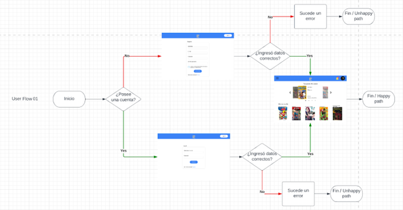
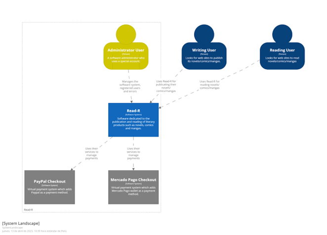

 

## Universidad Peruana de Ciencias Aplicadas

### Desarrollo de aplicaciones Open Source

#### Sección: WX52

#### Profesor: Juan Antonio Flores Moroco

### Informe del trabajo final

### Grupo 1

### "Readr"

### Ciclo 2023-2

| Nombres y Apellidos | Código |
|----------|----------|
| Stevens Kharis Acha Esquerre | u20201e735 |
| Row 2    | Cell 5   |
| Leonardo Manuel Dueñas Canales    | u202117475   |
| Fabrizzio Hernán Laguerre Challco    | u20211a950   |
| Salomón Zegarra Moreno    | u201917922   |

#### AGOSTO 2023

----

# Registro de versión del informe 

| Versión | Fecha | Autor | Descripción de modificación |
|----------|----------|----------|----------|
| 1.0   | 27/08/2023   | Salomón Zegarra Moreno |Creación del reporte y se definió la estructura del informe|

-----

# Project Report Collaboration Insights
[Repository to Final Report](https://github.com/Programadores-de-lavadoras/Report)

----
# Tabla de Contenido
- [Capitulo I: Introducción](#capitulo-i-introducción)
    - [Startup Profile](#11-startup-profile)
        - [Descripción de la Startup](#111-descripción-de-la-startup)  
        - [Perfiles de integrantes del equipo](#112-perfiles-de-integrantes-del-equipo)  
    - [Solution Profile](#12-solution-profile)
        - [Antecedentes y Problemática](#121-antecedentes-y-problemática)  
        - [Lean UX Process](#122-lean-ux-process)  
        - [Lean UX Problem Statements](#1221-lean-ux-problem-statements)  
        - [Lean UX Assumptions](#1222-lean-ux-assumptions)  
        - [Lean UX Hypothesis Statements](#1223-lean-ux-hypothesis-statements)  
        - [Lean UX Canvas](#1224-lean-ux-canvas)  
    - [Segementos Objetivos](#13-segementos-objetivos)
- [Capítulo II: Requirements Elicitation & Analysis](#capítulo-ii-requirements-elicitation--analysis)
    - [Competidores](#21-competidores)
        - [Análisis Competitivo](#211-análisis-competitivo)
        - [Estrategias y tácticas frente a competidores](#212-estrategias-y-tácticas-frente-a-competidores)
    -  [Entrevistas](#22-entrevistas)
        - [Diseño de entrevistas](#221-diseño-de-entrevistas)
        - [Registro de entrevistas](#222-registro-de-entrevistas)
        - [Análisis de entrevistas](#223-análisis-de-entrevistas)
    - [Needfinding](#23-needfinding)
        - [User Personas](#231-user-personas)
        - [User Task Matrix](#232-user-task-matrix)
        - [User Journey Mapping](#233-user-journey-mapping)
        - [Empathy Mapping](#234-empathy-mapping)
        - [As-Is Scenario Mapping](#235-as-is-scenario-mapping)
- [Capítulo III: Requirements Specification](#capítulo-iii-requirements-specification)
    - [To-Be Scenario Mapping](#31-to-be-scenario-mapping)
    - [User Stories](#32-user-stories)
    - [Impact Mapping](#33-impact-mapping)
    - [Product Backlog](#34-product-backlog)
- [Capítulo IV: Product Design](#capítulo-iv-product-design)
    - [Style Guidelines](#41-style-guidelines)
        - [General Style Guidelines](#411-general-style-guidelines)
        - [Web Style Guidelines](#412-web-style-guidelines)
    - [Information Architecture](#42-information-architecture)
        - [Organization Systems](#421-organization-systems)
        - [Labeling Systems](#422-labeling-systems)
        - [SEO Tags and Meta Tags](#423-seo-tags-and-meta-tags)
        - [Searching Systems](#424-searching-systems)
        - [Navigation Systems](#425-navigation-systems)
    - [Landing Page UI Design](#43-landing-page-ui-design)
        - [Landing Page UI Design](#431-landing-page-ui-design)
        - [Landing Page Mock-up](#432-landing-page-mock-up)
    - [Web Applications UX/UI Design](#44-web-applications-uxui-design)
        - [Web Application Wireframes](#441-web-application-wireframes)
        - [Web Application Wireflow Diagrams](#442-web-application-wireflow-diagrams)
        - [Web Applicationns Mock-up](#443-web-applicationns-mock-up)
        - [Web Application User Flow Diagrams](#444-web-application-user-flow-diagrams)
    - [Web Application Prototyping](#45-web-application-prototyping)
    - [Domain-Driven Software Architecture](#46-domain-driven-software-architecture)
        - [Software Architecture Context Diagram](#461-software-architecture-context-diagram)
        - [Software Architecture Container Diagrams](#462-software-architecture-container-diagrams)
        - [Software Architecture Components Diagram](#463-software-architecture-components-diagram)
    - [Software Object-Oriented Design](#47-software-object-oriented-design)
        - [Class Diagrams](#471-class-diagrams)
        - [Class Dictionary](#472-class-dictionary)
    - [Database Design](#48-database-design)
        - [Database Diagram](#481-database-diagram)

- [Capítulo V: Product Implementation, Validation, & Deployment](#capítulo-v-product-implementation-validation--deployment)
    - [Software Configuration Managment](#51-software-configuration-managment)
        - [Software Development Enviroment Configuration](#511-software-development-enviroment-configuration)
        - [Source Code Managment](#512-source-code-managment)
        - [Source Code Style Guide & Conventions](#513-source-code-style-guide--conventions)
        - [Software Deployment Configuration](#514-software-deployment-configuration)
    - [Landing Page, Services & Applications Implementation](#52-landing-page-services--applications-implementation)
        - [Sprint 1](#521-sprint-1)
            - [Sprint Planning 1](#5211-sprint-planning-1)
            - [Sprint Backlog 1](#5212-sprint-backlog-1)
            - [Development Evidence for Sprint Review](#5213-development-evidence-for-sprint-review)
            - [Testing Suite Evidence for Sprint Review](#5214-testing-suite-evidence-for-sprint-review)
            - [Execution Evidence for Sprint Review](#5215-execution-evidence-for-sprint-review)
            - [Services Documentation Evidence for Sprint Review](#5216-services-documentation-evidence-for-sprint-review)
            - [Software Deployment for Sprint Review](#5217-software-deployment-for-sprint-review)
            - [Team Collaboration Insights during Sprint](#5218-team-collaboration-insights-during-sprint)
- [Conclusiones](#conclusiones)
- [Bibliografía](#bibliografía)
- [Anexos](#anexos)

----

# Capitulo I: Introducción
## 1.1. Startup Profile
### 1.1.1. Descripción de la Startup
--escribir aquí--
### 1.1.2. Perfiles de integrantes del equipo
--escribir aquí--
## 1.2. Solution Profile
### 1.2.1. Antecedentes y Problemática
--escribir aquí--
### 1.2.2. Lean UX Process
#### 1.2.2.1. Lean UX Problem Statements
--escribir aquí--
#### 1.2.2.2. Lean UX Assumptions
--escribir aquí--
#### 1.2.2.3. Lean UX Hypothesis Statements
--escribir aquí--
#### 1.2.2.4. Lean UX Canvas
--escribir aquí--
## 1.3. Segementos Objetivos
--escribir aquí-- 

# Capítulo II: Requirements Elicitation & Analysis
## 2.1. Competidores
### 2.1.1. Análisis Competitivo
--escribir aquí--
### 2.1.2. Estrategias y tácticas frente a competidores
--escribir aquí--
## 2.2. Entrevistas
### 2.2.1. Diseño de entrevistas
--escribir aquí--
### 2.2.2. Registro de entrevistas
--escribir aquí--
### 2.2.3. Análisis de entrevistas
--escribir aquí--
## 2.3. Needfinding
### 2.3.1. User Personas
--escribir aquí--
### 2.3.2. User Task Matrix
--escribir aquí--
### 2.3.3 User Journey Mapping
--escribir aquí--
### 2.3.4. Empathy Mapping
--escribir aquí--
### 2.3.5 As-Is Scenario Mapping
--escribir aquí--

# Capítulo III: Requirements Specification
## 3.1. To-Be Scenario Mapping
--escribir aquí--
## 3.2. User Stories
--escribir aquí--
## 3.3. Impact Mapping
--escribir aquí--
## 3.4. Product Backlog
--escribir aquí--

# Capítulo IV: Product Design
## 4.1. Style Guidelines
### 4.1.1. General Style Guidelines
Para el branding de la startup se tendrá a disposición las siguientes imágenes:

Por otro lado, el branding que utilizaremos para nuestro servicio (nombre-aplicación), serán los siguientes modelos:

imagen xd

#### **Typography**
Se optó por utilizar la tipografía "Inter", debido a que es simple, fácil de leer y está diseñada para ayudar con la legibilidad de letras minúsculas y mayúsculas para el lector. (Google fonts, s.f.).

#### **Colors**
Brand colors:

Para el resto de colores de los aspectos básicos de la aplicación, se utilizará la siguiente paleta de colores:

#### **Spacing**

Para el uso de espaciado en nuestra aplicación, usaremos multiplos de 8 en un rango amplio para poder tener a nuestra disposición distintos tamaños para los elementos según sea requerido.

#### **Tono de comunicación y lenguaje aplicado**

Al tener como segmento objetivo a jóvenes (en su mayoría) y adultos lectores y/o escritores de fanfics, en un rango de entre 18 y 40 años, hemos optado por utilizar un tono divertido, casual, respetuoso y sereno para que estos puedan sentir que están en una aplicación juvenil, remarcando la energía y emoción al momento de leer sus historias favoritas.

### 4.1.2. Web Style Guidelines

Uno de los aspectos más importantes en el desarrollo web es el uso correcto del responsive design para que la aplicación se visualice perfectamente sin importar el tamaño de la pantalla o dispositivo.

Por esta razón, se decidió realizar el desarrollo de nuestra solución tomando en cuenta los siguientes breakpoints para que el responsive design se muestre correctamente:

| Breakpoint prefix | Minimum width |
|-----------|----------|
| sm | 640px |
| Md | 768px |
| L | 1024px |
| xl | 1280px |
| 2xl | 1536px |

Con respecto a los estándares visuales, se utilizarán los mismos elementos presentados en la sección anterior para lograr uniformidad en todo el uso de nuestra aplicación. Igualmente, las medidas y propiedades presentadas son escalables, manejables y compatibles con el desarrollo de responsive design.

## 4.2. Information Architecture
### 4.2.1. Organization Systems

El área de diseño de nuestra startup decidió enfocarse principalmente en la facilidad o satisfacción que el usuario tendrá al usar nuestra aplicación. Todos los elementos de diseño que hemos utilizado como las paletas de colores, imágenes e íconos, han seguido una tendencia minimalista con el fin de no exponer a los usuarios con tanta información.

### 4.2.1. Organization Systems

En el caso del landing page de nuestra aplicación nos hemos basado en el sistema de organización jerárquica (o “Visual hierarchy”, en inglés). La razón de esta elección es debido al impacto positivo que una página bien distribuida según tamaños, espacios y colores brinda al usuario. Por ejemplo, en la primera vista del landing page se añadirán elementos de tamaños grandes y con colores únicos (como el botón call to action), para captar la atención del visitante. Asimismo, mientras se hace scroll down por la página los tamaños se verán reducidos.

Por otro lado, cuando el usuario entre a la aplicación web en sí, utilizaremos un sistema de organización matricial (en inglés, “Matrix”). Este sistema, a diferencia del jerárquico, es un poco más complejo para el usuario porque está diseñado para que el usuario tome el control de su navegación (tubik, 2017). Sin embargo, al ser una aplicación basada en la lectura y/o escritura fanfics, es necesario dividir las secciones de esta manera para que se pueda tener mejor organizado lo que ofrecemos.

En nuestra aplicación se aplican los cuatro esquemas de categorización de contenido, mediante un sistema de filtros para buscar contenido. Se podrá rotar entre el Alphabetical, Chronological, Topic y Audience schemes.

### 4.2.2. Labeling Systems

Sera realizado de tal forma que las palabras utilizadas sean simples y fáciles de entender. Las etiquetas en la aplicación tendrán un máximo de cuatro palabras.

Esto se verá reflejado cuando hagamos la presentación del landing page y web application, de manera que sea más sencillo entender este concepto y cómo buscamos realizarlo.

### 4.2.3. SEO Tags and Meta Tags

Title: Readr

Description: Registrate y descrubre las mejores historias de tus personajes favoritos, o escribe tus propias historias. Adentrate en Readr!

Keywords: Fanfic, Fanfiction, Lectura, Novelas, Escritura.

Author: Programadores de Lavadoras.
### 4.2.4. Searching Systems

Se optó por implementar una interfaz que resalte los botones  e información principal para llamar la atención de los usuarios más emocionales e invitarlos a entrar en nuestra aplicación. Sin embargo, para los usuarios racionales, se ha brindado información más detallada para que puedan tomar la decisión de utilizar nuestro producto.

Es por estas razones que disponemos de los botones “call to action” que permiten llevar al usuario al registro para empezar a hacer uso de la aplicación. Se han posicionado al inicio y al final del landing page.

Con respecto a la aplicación, vamos a resaltar los subtítulos más importantes que dividen las funcionalidades de esta, para que a los usuarios se les facilite encontrar lo que buscan.

### 4.2.5. Navigation Systems

Se buscará priorizar fluidez a través de todo el contenido de nuestra landing page y aplicación web, con la capacidad de encontrar toda la información necesaria.

De esta manera, el usuario no se sentirá frustrado o confundido por una mala organización de la información.

En consecuencia, todo el diseño trabajado para nuestro proyecto, será enfocado en cumplir estas reglas establecidas.

## 4.3. Landing Page UI Design
### 4.3.1. Landing Page UI Design

### 4.3.2. Landing Page Mock-up

## 4.4. Web Applications UX/UI Design
### 4.4.1. Web Application Wireframes
Register

Log in

Home 1

Home 2

Home 3

My profile

Another person profile

Creations 1

Creation 2

Reading

Writing

Authors

### 4.4.2. Web Application Wireflow Diagrams

User goal 01: Entrar a la aplicación mediante una cuenta

1.	Ingresa a la aplicación web "FicUniverse".
2.	Si tiene una cuenta inicia sesión. Si no, se registra.
3.	Entra a la cuenta.

User goal 02: Ingresar al perfil de usuario

1.	Ingresa a la aplicación web “FicUniverse”.
2.	Hace click en la foto de perfil de usuario.
3.	Visualiza sus datos.

User goal 03: Leer un Fanfic

1.	Ingresa a la aplicación web "FicUniverse".
2.	Abre el menú lateral.
3.	Selecciona la opción “Creaciones”.
4.	Selecciona el fanfic que desee.
5.	Se abre la vista de lectura.

User goal 04: Escribir cualquier Fanfic

1.	Ingresa a la aplicación "FicUniverse".
2.	Abre el menú lateral.
3.	Selecciona la opción “Escribir”.
4.	Edita su obra.

User goal 05: Buscar y seleccionar un autor

1.	Ingresa a la aplicación "FicUniverse".
2.	Abre el menú lateral.
3.	Selecciona la opción “Autores”.
4.	Escoge el autor que desee.
5.	Visualiza su perfil

### 4.4.3. Web Applicationns Mock-up

 Register

Log in

Home 1

Home 2

Home 3

My profile

Another person profile

Creation 1

Creation 2

Reading 

Writing

Authors

### 4.4.4. Web Application User Flow Diagrams

User Flow 01: Entrar a la aplicación mediante una cuenta

- Happy path: Puede crear una cuenta o iniciar sesión satisfactoriamente
- Unhappy path: No ingresa los datos correctamentes

User Flow 02: Ingresar al perfil de usuario

- Happy path: Puede visualizar sus datos del perfil
- Unhappy path: No ingresa a su perfil o no se visualizan los datos

User Flow 03: Leer un fanfic
- Happy path: Puede leer la creación seleccionada
- Unhappy path: No carga la selección o no se muestra la información

User Flow 04: Escribir cualquier obra

- Ingresa a la aplicación “FicUniverse”.
- Selecciona la opción “Escribir”.
- Edita su obra.

User goal 05: Buscar y seleccionar un autor

- Ingresa a la aplicación “FicUniverse”.
- Selecciona la opción “Autores”.
- Escoge el autor que desee.
- Visualiza su perfil

## 4.5. Web Application Prototyping

Para la creación del prototipo de la Web Application nos hemos enfocado en las funcionalidades más importantes de nuestra aplicación. Es decir, poder leer o escribir libros, cómics o mangas. De igual manera, hemos agregado otras funcionalidades como vista de perfiles o autores para que se entienda mejor cómo funciona el apartado social de la aplicación.

## 4.6. Domain-Driven Software Architecture

Para esta sección hemos empleado los principios de Domain-Driven Design (DDD) en conjunto con el modelo de visualización de la arquitectura de software C4 (Context, container, components and code).

**Herramientas del domain-driven design:**

A continuación, se muestran los principales ejemplos del uso de las herramientas de DDD aplicados a nuestro dominio, tales como el Storytelling, Event Storming, Domain message flow modeling y Bounded context canvas.

**Storytelling:**

Publishing a literary product:

Looking for a literary product:

Reading a literary producto
 

**Event storming:**

Leyenda

Publicación de productos literarios

Visualizacion de productos literarios

Lectura de productos literarios

**Domain Message Flow Modeling:**

Elementos

Escenario: Publicación de un producto literario nuevo

**Bounded context canvas:**

Leyenda de colaboradores

Publicación de un producto literario

En esta sección se especifican los Ubiquitous Language para cada subdominio del negocio. Sin embargo, no es necesario especificarlo para todos ya que el negocio no presenta términos complejos, sino palabras claves conocidas por todos los involucrados.

### 4.6.1. Software Architecture Context Diagram

Este diagrama corresponde al diagrama de contextos del modelo C4. En él se detalla los principales usuarios, nuestro sistema y los sistemas externos que emplearemos. Asimismo, se muestra la relación entre cada elemento.

Landscape diagram:

### 4.6.2. Software Architecture Container Diagrams

Este diagrama corresponde al diagrama de contenedores del modelo C4. Aquí se especifican los contenedores y bounded context que conforman nuestro sistema Read-R, tomando elementos como el Landing, el Api Rest, la base de datos, etc. Y detalla en qué contexto están relacionados los sistemas externos con nuestro sistema de software.

### 4.6.3. Software Architecture Components Diagram

Estos diagramas corresponden a los diagramas de componentes del modelo C4. Aquí se detalla mucho más cada bounded context que conforma nuestro software Read-R, mostrando sus componentes y la relación entre ellos.

Account Context:

Visualization Context:

Publishing context:

Reading context:

Payment context:

## 4.7. Software Object-Oriented Design
### 4.7.1. Class Diagrams
--escribir aquí--
### 4.7.2. Class Dictionary
--escribir aquí--
## 4.8. Database Design
### 4.8.1. Database Diagram

# Capítulo V: Product Implementation, Validation, & Deployment
## 5.1. Software Configuration Managment
### 5.1.1. Software Development Enviroment Configuration
--escribir aquí--
### 5.1.2. Source Code Managment
--escribir aquí--
### 5.1.3. Source Code Style Guide & Conventions
--escribir aquí--
### 5.1.4. Software Deployment Configuration
--escribir aquí--
## 5.2. Landing Page, Services & Applications Implementation
### 5.2.1. Sprint 1
#### 5.2.1.1. Sprint Planning 1
--escribir aquí--
#### 5.2.1.2. Sprint Backlog 1
--escribir aquí--
#### 5.2.1.3. Development Evidence for Sprint Review
--escribir aquí--
#### 5.2.1.4. Testing Suite Evidence for Sprint Review
--escribir aquí--
#### 5.2.1.5. Execution Evidence for Sprint Review
--escribir aquí--
#### 5.2.1.6. Services Documentation Evidence for Sprint Review
--escribir aquí--
#### 5.2.1.7. Software Deployment for Sprint Review
--escribir aquí--
#### 5.2.1.8. Team Collaboration Insights during Sprint
--escribir aquí--

---
# Conclusiones

--escribir aquí--

---
# Bibliografía

--escribir aquí--

---
# Anexos

--escribir aquí--
